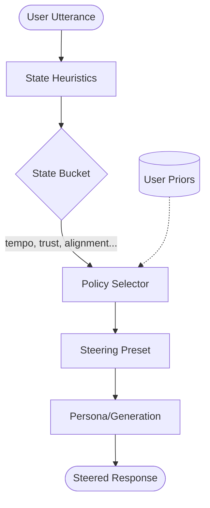
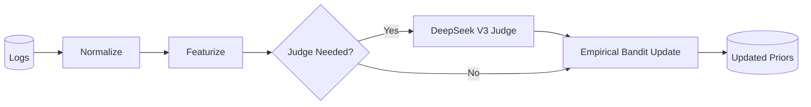

# train-convo-steering

Adaptive conversation steering for voice-first AI agents. This skill learns per-user interaction "priors" to dynamically adjust the style, strategy, and prosody of the agent's responses.

## Core Objective

To provide a high-performance, reinforcement-learning-inspired "steering layer" that sits between the user's intent and the agent's persona. It ensures the assistant is always in sync with the user's current collaboration state (e.g., repairing trust, accelerating a task, or deep-diving into details).

## System Architecture

The skill operates in two distinct loops: **Runtime Inference** (fast, heuristic-driven) and **Nightly Learning** (deep, LLM-judged).

### 1. Runtime Steering Loop (Latency < 50ms)

Calculates the collaboration state and selects the optimal steering preset based on learned user preferences.



### 2. Nightly Learning Loop

Normalizes daily interaction logs and uses a "Judge" (DeepSeek V3) to label ambiguous turns, updating the user's empirical priors.



## Integration Map

### 🧠 /memory Integration

- **Interaction Logs**: Raw logs generated by `runtime-step` are ingested into episodic memory.
- **Learned Priors**: The `.json` prior files act as a "Collaboration Persona" for the user, stored and retrieved based on the `user_id`.
- **Context Retrieval**: Future versions will use `/memory recall` to pull long-term interaction patterns to seed the initial state bucket.

### 👤 /personas Integration

- **Response Knobs**: The selected `SteeringPreset` adjusts parameters (length, tone, initiative) before they reach the persona's generation prompt.
- **Voice Prosody**: For voice channels, the preset influences the TTS engine (e.g., speaking faster, increasing pitch, adding pauses for "Socratic" mode).
- **Style Steering**: While the _content_ comes from the persona, the _delivery rhythm_ is controlled by this skill.

## Key Concepts

| Concept                 | Description                                                                 |
| ----------------------- | --------------------------------------------------------------------------- |
| **Collaboration State** | A 5-dimensional bucket: `tempo`, `trust`, `alignment`, `affect`, `control`. |
| **Steering Preset**     | A pre-defined "mode" like `trust_repair`, `fast_proceed`, or `deep_dive`.   |
| **Prior**               | A learned map for a specific user: `State -> Best Preset`.                  |
| **Tenacious Judge**     | Offline use of DeepSeek V3 to resolve failures and improve the policy.      |

## Quick Start

### Runtime Step

Used within the agent's main loop to decide how to respond:

```bash
./run.sh runtime-step --user-id "user123" --channel "voice" --user-text "no, that's not what I meant"
```

### Nightly Update

Scheduled via `scheduler` to run daily:

```bash
./run.sh nightly --logs logs/live.jsonl --out ./learned_data
```

---

_Part of the Horus Persona Collaboration Layer._
