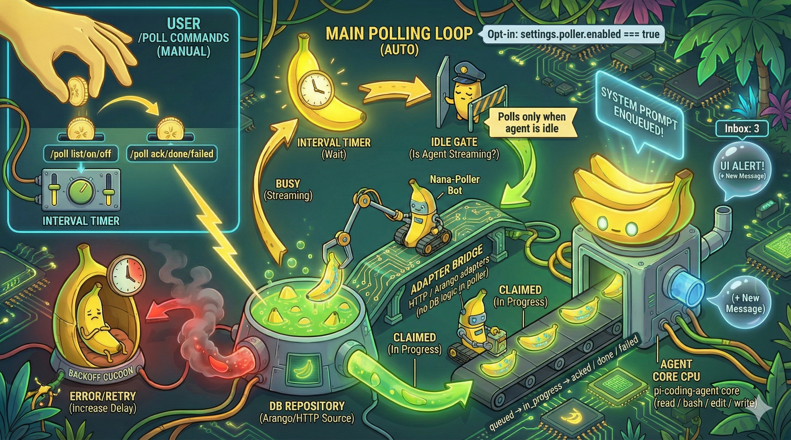

# Poller Module (Fork-only)



Opt-in idle-only polling with alerts and `/poll` controls. Pluggable adapters: ArangoDB (`arangojs`) or HTTP (e.g., python-arango service).

## Why this exists (and why it's fork-only)

The upstream `pi-coding-agent` deliberately avoids **background behavior** and **sub-agents**. Everything is supposed to happen in the single interactive loop you see in the TUI.

This poller is a pragmatic escape hatch for setups where you:
- Have a shared message store (DB or HTTP API) that needs to feed work into the coding agent.
- Want the agent to surface new work while idle (e.g., "Inbox: 3") instead of manually pasting payloads.
- Need to glue other systems (Slack bots, pods, CI, etc.) to `pi-coding-agent` via a simple DB/API contract.

Because it bends the "no background" philosophy, it is:
- **Opt-in only** (disabled unless `settings.poller.enabled` is true).
- **Idle-only** (never polls while the agent is streaming).
- **Decoupled** and safe to remove (all logic lives under `src/poller/**` plus a small optional bootstrap in `main.ts` / `settings-manager.ts`).

If you want a pure, upstream-aligned experience, simply remove the poller wiring and delete the `poller` block from your settings file.

## What problems it solves

- **Inbox of external work**  
  Treat the DB as an inbox of messages for the agent. The poller periodically:
  - Fetches queued messages for a given `agentId`.
  - Claims them with a lease (`in_progress`) so other agents don't double-process.
  - Enqueues system prompts so the agent can act on them.
  - Updates an "Inbox: N" counter in the UI.

- **Clear completion semantics**  
  The user (or higher-level automation) drives completion via `/poll`:
  - `/poll` → see what is in the inbox.
  - `/poll ack|done|failed <id>` → update status in the DB via the adapter.

- **Adapter-based integration**  
  The poller never talks to a DB directly. It only knows about an `IDatabaseAdapter`:
  - `ArangoAdapter` for ArangoDB.
  - `HttpAdapter` for any HTTP service (e.g., python-arango, custom API).
  This keeps DB logic out of the agent core and lets you swap backends without changing the poller.

## How it stays decoupled

- No changes to tools (`read`, `write`, `edit`, `bash`) or the agent core.
- One optional settings block (`poller`) in `settings.json`.
- A small bootstrap hook in `main.ts` that calls `createPollerRuntime()` **only if** settings are present and `enabled: true`.
- Removing the poller is as simple as:
  - Deleting `src/poller/**`.
  - Removing the import / call in `main.ts`.
  - Dropping the `poller` section from `settings.json`.

## Configure
Add to your settings (e.g., `~/.pi/agent/settings.json`):
```json
{
  "poller": {
    "enabled": true,
    "pollIntervalMs": 5000,
    "agentId": "ProjectA",
    "backend": "arangojs",
    "arango": {
      "url": "http://localhost:8529",
      "database": "agents",
      "username": "root",
      "password": "openSesame",
      "messagesCollection": "messages"
    },
    "batchLimit": 25,
    "leaseMs": 120000,
    "backoff": { "initialMs": 1000, "factor": 2, "maxMs": 30000, "failureThreshold": 3 },
    "options": { "lruDedupSize": 128, "autoProcessNext": false }
  }
}
```

## Wire-up
```ts
import { createPollerRuntime } from "./poller/setup.js";

const pollerSettings = settingsManager.getPollerSettings();
const runtime = await createPollerRuntime(agent, pollerSettings, (count) => {
  // e.g., feed into status bar
});
```

## Use
- Alerts when new messages arrive.
- `/poll` → list inbox
- `/poll on|off` → toggle
- `/poll interval <ms>` → change interval
- `/poll ack|done|failed <id>` → update status

## Notes
- Fork-only; upstream avoids background behavior.
- Security: use headers/tokens; least privilege.
- Resilience: backoff with degraded/recovered notices; leases avoid duplicates.
