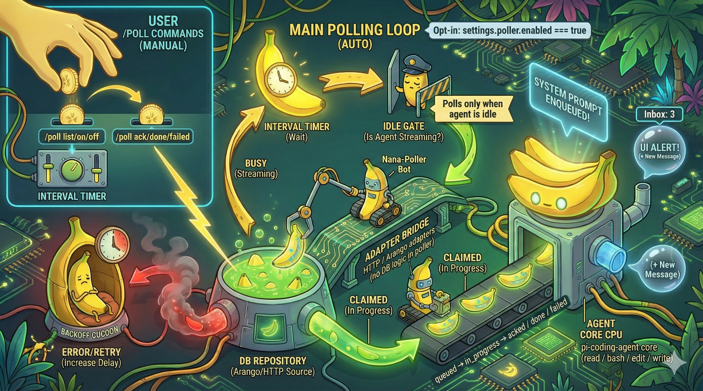

# Poller Module (Fork-only)



Opt-in idle-only polling with alerts and `/poll` controls. Pluggable adapters: ArangoDB (`arangojs`) or HTTP (e.g., python-arango service).

## Why this exists (and why it's fork-only)

The upstream `pi-coding-agent` deliberately avoids **background behavior** and **sub-agents**. Everything is supposed to happen in the single interactive loop you see in the TUI.

This poller is a pragmatic escape hatch for setups where you:
- Have a shared message store (DB or HTTP API) that needs to feed work into the coding agent.
- Want the agent to surface new work while idle (e.g., "Inbox: 3") instead of manually pasting payloads.
- Need to glue other systems (Slack bots, pods, CI, etc.) to `pi-coding-agent` via a simple DB/API contract.

Because it bends the "no background" philosophy, it is:
- **Opt-in only** (disabled unless `settings.poller.enabled` is true).
- **Idle-only** (never polls while the agent is streaming).
- **Decoupled** and safe to remove (all logic lives under `src/poller/**` plus a small optional bootstrap in `main.ts` / `settings-manager.ts`).

If you want a pure, upstream-aligned experience, simply remove the poller wiring and delete the `poller` block from your settings file.

## What problems it solves

- **Inbox of external work**  
  Treat the DB as an inbox of messages for the agent. The poller periodically:
  - Fetches queued messages for a given `agentId`.
  - Claims them with a lease (`in_progress`) so other agents don't double-process.
  - Enqueues system prompts so the agent can act on them.
  - Updates an "Inbox: N" counter in the UI.

- **Clear completion semantics**  
  The user (or higher-level automation) drives completion via `/poll`:
  - `/poll` → see what is in the inbox.
  - `/poll ack|done|failed <id>` → update status in the DB via the adapter.

- **Adapter-based integration**  
  The poller never talks to a DB directly. It only knows about an `IDatabaseAdapter`:
  - `ArangoAdapter` for ArangoDB.
  - `HttpAdapter` for any HTTP service (e.g., python-arango, custom API).
  This keeps DB logic out of the agent core and lets you swap backends without changing the poller.

## Example: extractor agent → coding agent

One motivating workflow for this fork mirrors the “agent-to-agent comms” pattern from Codex:

- You run a **per-project extractor agent** that digests logs, telemetry, or other repos.
- When it finds something actionable (bug, refactor, task), it writes a message into the shared
  `messages` collection for a specific `agentId` (for example, `ProjectA`).
- The **coding agent** runs with the poller enabled and the same `agentId`. While idle, it
  discovers these messages, turns them into system prompts, and surfaces them in the TUI inbox.
- You (or another automation layer) drive completion via `/poll ack|done|failed <id>`.

At the Arango level, the extractor just needs to insert a document like:

```jsonc
{
  "to_agent": "ProjectA",
  "from_agent": "extractor-pi",
  "type": "task",
  "status": "queued",
  "payload_ref": "gh://repo#1234",   // optional pointer (issue/PR/etc.)
  "payload": {                       // optional inline details
    "summary": "Flaky test in foo.test.ts",
    "repro": "npm test foo -- --runInBand"
  }
}
```

From that point on:
- The poller claims it (`status: in_progress`, lease set).
- The coding agent sees a system prompt describing the task and uses its normal tools.
- When the work is truly done, `/poll done <id>` pushes the final status back into Arango.

This keeps:
- **Extractor logic** (BM25/graph search, heuristics, etc.) in its own service or agent.
- **Inbox + execution** responsibilities in the coding agent.
- A clean, DB-level contract (`messages` collection) between agents.

## How it stays decoupled

- No changes to tools (`read`, `write`, `edit`, `bash`) or the agent core.
- One optional settings block (`poller`) in `settings.json`.
- A small bootstrap hook in `main.ts` that calls `createPollerRuntime()` **only if** settings are present and `enabled: true`.
- Removing the poller is as simple as:
  - Deleting `src/poller/**`.
  - Removing the import / call in `main.ts`.
  - Dropping the `poller` section from `settings.json`.

## Further reading

- `CONTRACT.md` – full architecture, lifecycle, and acceptance criteria.
- `QUICKSTART.md` – concrete configuration examples, wiring, and troubleshooting tips.
- `scripts/poller-smoke.mjs` – inserts a test message into Arango for a quick manual end-to-end check.

## Alternative: external queue worker (tmux-friendly)

The upstream maintainer prefers keeping queue consumption **outside** the coding agent:
- A small worker process pops jobs from Arango (or any queue).
- For each job, it runs `pi-coding-agent` once in JSON mode and writes results back.

This fork ships a minimal example at `scripts/queue-worker.mjs`:

```bash
cd /home/graham/workspace/experiments/pi-mono/packages/coding-agent
export PI_CODING_AGENT_DIR=./src/poller
node scripts/queue-worker.mjs
```

That script:
- Selects a few `queued` messages for the configured `agentId`.
- Marks them `in_progress` with a short lease.
- Builds a simple system prompt and runs `node dist/cli.js -p "<prompt>" --mode json --no-session`.
- Marks the message `done` (exit code 0) or `failed` (non-zero).

To run it continuously in the background with `tmux`:

```bash
cd /home/graham/workspace/experiments/pi-mono/packages/coding-agent
tmux new -s queue-worker '
  export PI_CODING_AGENT_DIR=./src/poller;
  while true; do
    node scripts/queue-worker.mjs;
    sleep 5;
  done
'
```

Use this pattern when you want **fully automated** processing with no TUI at all. Use the in-process poller + `/poll`
commands when you want an interactive “Inbox: N” experience inside the coding agent.

## Configure

For this experimental fork, the easiest self-contained setup is:

1. Point the coding agent at a project-local settings directory:

   ```bash
   export PI_CODING_AGENT_DIR=./packages/coding-agent/src/poller
   ```

2. Copy the example settings file and edit it:

   ```bash
   cd packages/coding-agent/src/poller
   cp settings.example.json settings.json
   # then fill in your real Arango URL, database, collection, and credentials
   ```

On first startup, the poller will automatically create the configured database and
messages collection in ArangoDB if they do not exist (similar to python-arango).

If you prefer a global setup, you can still omit `PI_CODING_AGENT_DIR`, in which case
the coding agent uses the default `~/.pi/agent/settings.json`.

A typical `settings.json` looks like this:
```json
{
  "poller": {
    "enabled": true,
    "pollIntervalMs": 5000,
    "agentId": "ProjectA",
    "backend": "arangojs",
    "arango": {
      "url": "http://localhost:8529",
      "database": "agents",
      "username": "root",
      "password": "openSesame",
      "messagesCollection": "messages"
    },
    "batchLimit": 25,
    "leaseMs": 120000,
    "backoff": { "initialMs": 1000, "factor": 2, "maxMs": 30000, "failureThreshold": 3 },
    "options": { "lruDedupSize": 128, "autoProcessNext": false }
  }
}
```

## Wire-up
```ts
import { createPollerRuntime } from "./poller/setup.js";

const pollerSettings = settingsManager.getPollerSettings();
const runtime = await createPollerRuntime(agent, pollerSettings);
if (runtime) {
  // Subscribe to inbox count changes for status bar / badge
  runtime.poller.events.on("inboxIncrement", (delta) => {
    // e.g., update "Inbox: N" in the TUI
  });

  // Use runtime.uiBridge from your /poll command handler:
  // - runtime.uiBridge.listInbox()
  // - runtime.uiBridge.setEnabled(true|false)
  // - runtime.uiBridge.setIntervalMs(ms)
  // - runtime.uiBridge.updateStatus(id, "acked" | "done" | "failed")
}
```

## Use
- Alerts when new messages arrive.
- `/poll` → list inbox
- `/poll on|off` → toggle
- `/poll interval <ms>` → change interval
- `/poll ack|done|failed <id>` → update status

## Notes
- Fork-only; upstream avoids background behavior.
- Security: use headers/tokens; least privilege.
- Resilience: backoff with degraded/recovered notices; leases avoid duplicates.
