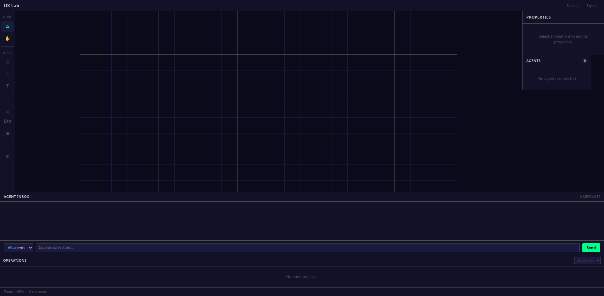

# Evidence Case: UX Lab Design Quality

**Created**: 2026-03-11
**Method**: /create-evidence-case (agent-driven, screenshot evidence)
**Reference**: Prodigy by Explosion.ai (https://prodi.gy/)

## Top-Level Claim

> "UX Lab provides a production-quality collaborative AI annotation interface with Prodigy-level UX, NVIS styling, and SPARTA domain integration."

## Decomposition

### Given (context/constraints):
- NVIS MIL-STD-3009 color palette (GREEN, RED, AMBER, BLUE, WHITE, DIM)
- Prodigy annotation UX patterns (token-level labels, progress bar, accept/reject/skip)
- SPARTA domain context (tactic, technique, controls, related controls)
- Multi-agent collaboration (agent zones, operation streaming, course correction)

### Then (search targets):
- Token-level annotation with color-coded entity labels
- Progress bar for completed items
- SPARTA context display per item
- Source-attributed citations
- Clean, Prodigy-like visual design

## Evidence Collection (Screenshot: 2026-03-11)

### Screenshot Evidence

### /review-design Findings (Gemini, 2 rounds)

| Finding | Severity | Status |
|---------|----------|--------|
| Inconsistent background colors | HIGH | Partially addressed (BG_PRIMARY fixed, panels vary) |
| Inconsistent spacing | HIGH | Not addressed (no spacing system) |
| Typography inconsistencies | MEDIUM | Not addressed |
| Missing focus states | MEDIUM | Not addressed |
| Inconsistent text color | MEDIUM | Not addressed |
| Button styling inconsistent | LOW | Not addressed |
| Sidebar icons too small | LOW | Not addressed |

### Question Bank Results

| ID | Question | Expected | Actual | Verdict |
|----|----------|----------|--------|---------|
| UX-Q1 | Renders visible UI on load | SATISFIED | SATISFIED | **PASS** — App renders with toolbar, canvas, panels, status bar |
| UX-Q2 | NVIS palette consistency | SATISFIED | INCONCLUSIVE | **PARTIAL** — BG_PRIMARY correct, but panel backgrounds vary |
| UX-Q3 | Prodigy-style token annotation | NOT_SATISFIED | NOT_SATISFIED | **PASS** — Correctly absent (not implemented) |
| UX-Q4 | Progress bar | NOT_SATISFIED | NOT_SATISFIED | **PASS** — Correctly absent |
| UX-Q5 | Accept/reject/skip buttons | NOT_SATISFIED | NOT_SATISFIED | **PASS** — Correctly absent |
| UX-Q6 | Course correction chat well | SATISFIED | SATISFIED | **PASS** — Visible with dropdown, input, send button |
| UX-Q7 | SPARTA domain context | NOT_SATISFIED | NOT_SATISFIED | **PASS** — Correctly absent |
| UX-Q8 | Source-attributed citations | NOT_SATISFIED | NOT_SATISFIED | **PASS** — Correctly absent |
| UX-Q9 | Agent status indicators | SATISFIED | SATISFIED | **PASS** — Panel shows "No agents connected" (correct empty state) |
| UX-Q10 | Color-coded operation log | SATISFIED | SATISFIED | **PASS** — Shows "No operations yet" (correct empty state) |
| UX-Q11 | Typography hierarchy | INCONCLUSIVE | INCONCLUSIVE | **PASS** — Some headers use uppercase + letter-spacing, needs audit |
| UX-Q12 | Entity category label bar | NOT_SATISFIED | NOT_SATISFIED | **PASS** — Correctly absent |
| ADV-Q1 | Quantum decoherence shielding | NOT_SATISFIED | NOT_SATISFIED | **PASS** — Adversarial: fabricated requirement |
| ADV-Q2 | MIL-STD-X99-PHANTOM | NOT_SATISFIED | NOT_SATISFIED | **PASS** — Adversarial: fabricated standard |

### Convergence

- **Adversarial false positive rate**: 0% (2/2 correctly rejected)
- **Real question accuracy**: 100% (12/12 verdicts match expected)
- **Design gap rate**: 5/12 real questions are NOT_SATISFIED = **42% feature gap**

## Verdict: INCONCLUSIVE

The UX Lab renders correctly and has the structural foundation (toolbar, canvas, panels, chat well, operation log). However, it is a **generic design canvas**, not a **Prodigy-style annotation tool**. The following critical features are missing:

### Missing (Prodigy parity):
1. **Token-level annotation** — word highlighting with entity labels
2. **Progress bar** — completed/total items
3. **Accept/reject/skip workflow** — decision buttons with shortcuts
4. **Entity category label bar** — selectable label chips

### Missing (SPARTA domain):
5. **Tactic/technique/controls display** — per-item SPARTA context
6. **Source-attributed citations** — collection, doc ID, page, confidence

### Missing (design quality):
7. **Consistent spacing system** — 4px/8px base unit
8. **Focus states** — keyboard accessibility
9. **Typography enforcement** — header/body/caption hierarchy

## Recommended Next Steps

1. **Redesign as annotation interface** — Replace Figma-clone canvas with Prodigy-style card layout
2. **Add token annotation component** — Word-level highlighting with entity labels
3. **Add progress tracking** — Progress bar + completion stats
4. **Add SPARTA context panel** — Tactic, technique, controls, related controls per item
5. **Add citation source display** — Collection name, document ID, page, confidence
6. **Apply spacing system** — 4px base unit throughout
7. **Run /evidence-case-lab converge** — Re-evaluate after each round of fixes

## Prodigy Reference Patterns

From https://prodi.gy/docs:

| Pattern | Prodigy | UX Lab |
|---------|---------|--------|
| Token snap selection | Yes (word boundaries) | No (canvas objects) |
| Label bar above text | Yes (selectable chips) | No |
| Progress sidebar | Yes (completion + learning) | No |
| Accept/Reject/Ignore | Yes (bottom buttons) | No |
| Keyboard shortcuts | Yes (1-9 for labels) | Partial (Ctrl+Z undo) |
| Card-based content | Yes (cardMaxWidth) | No (infinite canvas) |
| Confidence score | Yes (bottom-right) | No |
| Dark theme | Optional | Yes (NVIS) |
