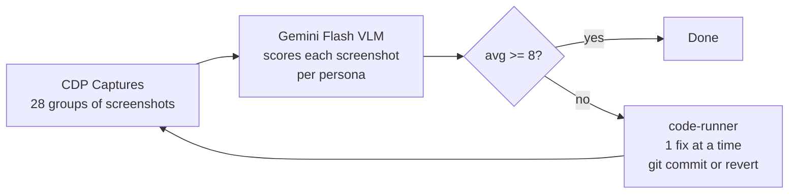

# Persona Review Pipeline

Three RE personas evaluate Binary Explorer via screenshots. Weaknesses get fixed. Repeat until 8+/10.

## How It Works



## The Three Personas

| Persona | Focus | Groups |
|---------|-------|--------|
| **Tim Blazytko** | Automation, pipelines, deobfuscation | 12 (graph-nav, node-detail, code-view, automation...) |
| **Gynvael Coldwind** | Low-level data, performance, precision | 11 (data-structures, context-menu, cross-refs, state-machines...) |
| **LiveOverflow** | Accessibility, learning, visual clarity | 11 (progressive-disclosure, learning-path, error-states...) |

## Phase Detail

```mermaid
sequenceDiagram
    participant O as /orchestrate
    participant CDP as CDP Captures
    participant G as Gemini Flash<br/>(via scillm)
    participant CR as code-runner
    participant Git as git

    rect rgb(30, 40, 50)
        Note over O,CDP: Phase 1 — Deterministic Screenshots (zero LLM)
        O->>CDP: node sim/run_cdp_captures.cjs
        CDP->>CDP: navigate, click, screenshot x 28 groups
    end

    rect rgb(30, 40, 60)
        Note over O,G: Phase 2 — VLM Batch Review (3 personas x 28 groups)
        O->>G: POST screenshots + persona prompt
        G-->>O: {score, verdict, weaknesses[]} x 34
    end

    rect rgb(40, 30, 40)
        Note over O,CR: Phase 3 — Gate Check
        O->>O: avg score >= 8.0?
    end

    alt FAIL
        rect rgb(50, 30, 30)
            Note over O,Git: Phase 4 — Fix Loop (sequential)
            loop top 10 weaknesses
                O->>CR: fix one weakness
                CR->>Git: score up? commit : revert
            end
        end
        Note over O: Back to Phase 1
    end
```



## Data Flow

```
persona-review-manifest.json     <- 34 reviews with criteria
         |
         v
run_cdp_captures.cjs             <- deterministic CDP -> Chrome
         |
         v
captures/persona-reviews/{group}/ <- PNG screenshots per group
         |
         v
vlm_batch_review.py              <- sends to Gemini Flash via scillm
         |                          uses persona_review_vlm_v1.txt template
         v
persona-review-manifest.json     <- updated with scores + weaknesses
persona-review-report.md         <- flat markdown table
persona-review-gate.json         <- {avg_score, gate: true/false}
         |
         v
code-runner                      <- pops weaknesses, fixes 1 at a time
         |                          git commit on improvement
         |                          git revert on regression
         v
(loop back to CDP captures)
```

## Key Decisions

1. **Gemini Flash for VLM** — multimodal, 1M context, cheaper than Qwen3-VL. Auto-routed by scillm when images are present.

2. **One capture set, three reviews** — Same screenshots evaluated by all three personas with different prompts. Saves 2/3 CDP time.

3. **Prior weaknesses injected** — Round 2+ prompts include Round 1 weaknesses so Gemini can verify fixes. `addressed_prior` tracks convergence.

4. **code-runner: one fix, one commit** — No concurrent edits. Git revert on regression. Strategy escalation if stuck.

5. **metric_gate at 8.0** — /orchestrate stops when average score passes. No infinite loops.

## Run It

```bash
# Full pipeline via /orchestrate
/orchestrate run packages/ux-lab/10_PERSONA_REVIEW_PIPELINE.yaml

# Manual steps
CDP_PORT=9253 node sim/run_cdp_captures.cjs              # Phase 1
python sim/vlm_batch_review.py review                     # Phase 2
python sim/vlm_batch_review.py review --dry-run           # Preview
python sim/vlm_batch_review.py review --persona tim-blazytko  # One persona
```
