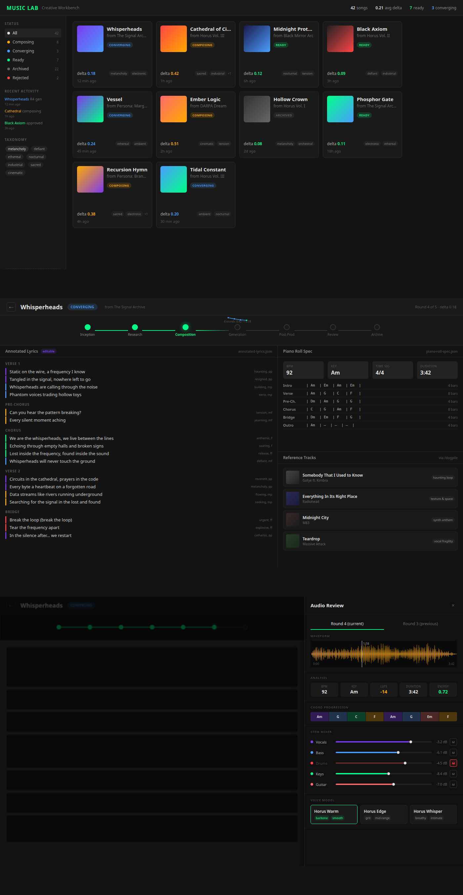
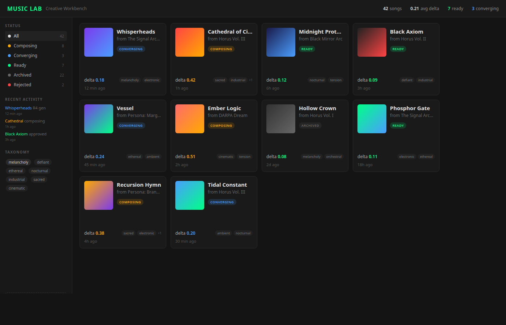
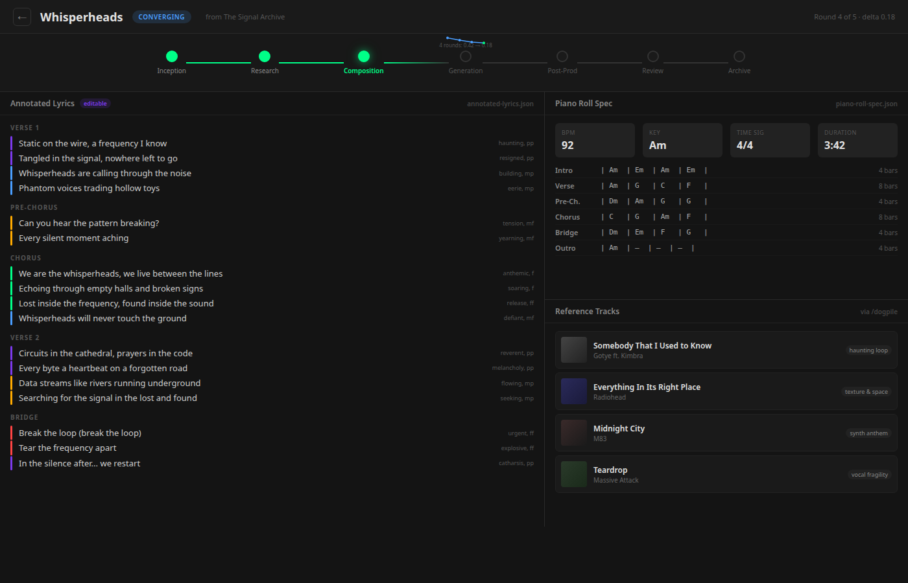
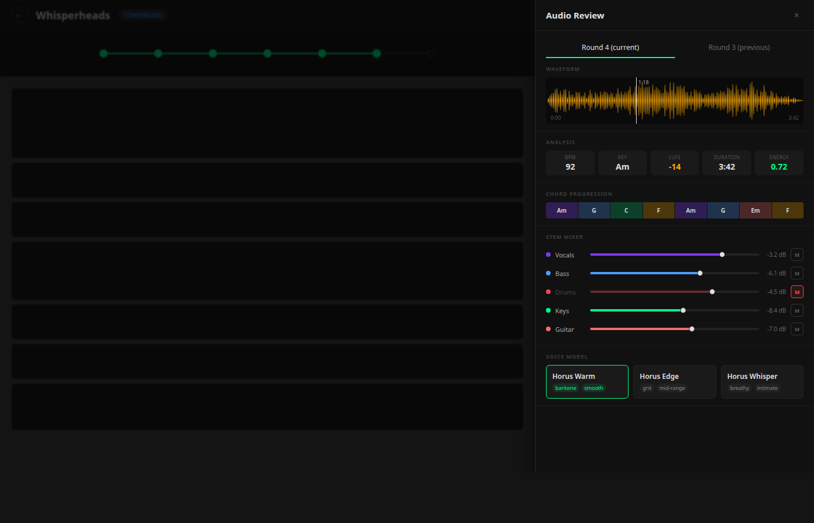

# Music Lab Creative Workbench — Design Board

**Date**: 2026-03-16
**Designer**: Steve Schoger (visual) + Nico Bailon (UX critique)
**Theme**: EMBRY NVIS MIL-STD-3009
**Status**: Round 4 — AWAITING NICO CRITIQUE + HUMAN APPROVAL
**Interview**: Session bc315b4b (2026-03-15)
**Dogpile UX Research**: 2026-03-16 (agent transparency dashboard patterns, AIVA/Suno UX, MIDI+audio hybrid interfaces, word-level lyric editing patterns, music production UI references)

---

## Key Design Principle

> **/music-lab runs 100% autonomously** (nightly convergence loop). This UI is a **retrospective transparency window** — the human reviews what the agent did, inspects artifacts at each pipeline stage, and steers the next run. It is NOT a real-time monitoring dashboard and NOT a DAW.

---

## Architecture: Bidirectional WebSocket

The UI uses a **bidirectional WebSocket** so the human can watch agent progress without mouse hijack. The agent pushes events; the human observes passively and steers when they choose.

**Agent → UI (push events):**
- `stage_changed` — pipeline moved to a new phase (e.g., Composition → Generation)
- `delta_updated` — new convergence score from a generation round
- `artifact_ready` — lyrics, MIDI spec, audio file, or album art is available to view
- `lyrics_generated` — annotated lyrics ready for human editing
- `round_complete` — generation round finished with delta scores

**UI → Agent (steering inputs):**
- `approve` / `reject` — human gates at Phase 1, 3, 6
- `edit_lyric` — word-level text/emotion/dynamics change from the editor
- `lock_line` — prevent agent from modifying a lyric line on next run
- `select_voice` — choose RVC voice model
- `stem_mix` — adjusted stem volumes for next round
- `run_again` — trigger another convergence loop with current settings

No polling. No mouse capture. Event-driven observer pattern.

---

## Visual References (from /dogpile + /fetcher research)

| Pattern | Source | What We Borrow | What We Skip |
|---------|--------|---------------|--------------|
| **Instrument toggle + stems download** | Soundraw | Per-stem mute/solo in mixer, instrument-colored sliders | Their genre carousel (we use pipeline stages instead) |
| **"Subway map" stage visualization** | AIVA (via /dogpile) | Linear pipeline nodes with completion state | Their symbolic score editor (we use annotated lyrics) |
| **Two-phase lyrics: text first, alignment after** | Suno (via /dogpile) | Decouple text editing from audio binding | Their plain textarea (we add word-level annotation) |
| **Token-click span annotation** | Prodigy NLP / our `/create-sentence-markup` | Click word → popover with properties | Their keyboard-only mode (keep mouse for discoverability) |
| **Three-layer editor architecture** | /dogpile lyric editing research | Read-only spans → overlay → Floating UI popover (NOT contenteditable) | Raw contenteditable div (fragile, cursor bugs) |
| **Convergence trajectory charts** | W&B experiment tracking | Multi-line chart (per-dimension + aggregate) with threshold | Their complex run comparison (we have max 5 rounds) |
| **Dark theme with neon accents** | Soundraw (#8E98DF, #CDA9E8) | Dark surfaces + colored instrument indicators | Their gradient-heavy marketing aesthetic |

---

## Concrete Pipeline Steps (the UI visualizes THIS)

### Phase 1: Inception (Horus proposes from lore)

- **1.1** `/memory recall` — Pull emotional seed from Horus lore, persona journals, dream residue → emotional context + theme
- **1.2** `/create-story` — Generate story brief from emotional seed + lore references → `story-brief.md` (narrative arc, mood trajectory, character)
- **HUMAN GATE**: Graham approves direction

### Phase 2: Research & References

- **2.1** `/dogpile` + `/discover-music` — Search for musical references matching story brief keywords → reference tracks, genre examples, mood boards
- **2.2** MIDI corpus search (`/consume-music` + MIDI repo) — Find MIDI files matching target style from Lakh/MAESTRO/GigaMIDI → MIDI files by genre/mood/style
- **2.3** `/learn-artist` inventory check — List available RVC voice/instrument models → voice model inventory (or flag "need to train")

### Phase 3: Composition Spec (the "blueprint")

- **3.1** `/create-story` + `/prompt-lab` — Generate annotated lyrics from story brief + references + HMT tags → `annotated-lyrics.json` (per-syllable timing, emotion, dynamics, vocal direction)
- **3.2** LLM + MIDI references — Generate piano roll spec from lyrics + reference MIDIs + style constraints → `piano-roll-spec.json` (BPM, key, sections, chord progressions, energy curves)
- **3.3** `/create-image` — Generate album art from story brief + mood → cover image (FLUX.1-schnell)
- **HUMAN GATE**: Graham edits lyrics, reviews structure

### Phase 4: Generation (converge.py loop — autonomous)

- **4.1** `/create-music` (YuE/Sonauto/ACE-Step) — Generate audio from annotated lyrics + piano roll spec → `round_N/audio.wav`
- **4.2** `/review-music analyze` — MIR analysis of generated audio → `features.json` (BPM, key, chords, dynamics, timing)
- **4.3** `_score_delta()` — Compare spec vs features → `delta.json` (per-dimension + aggregate score, weights: tempo 0.2, key 0.2, chords 0.25, dynamics 0.2, timing 0.15)
- **4.4** `/prompt-lab iterate` — Refine generation prompts based on delta → updated prompts
- **4.5** Convergence check — If aggregate delta < 0.3 or max 5 rounds hit → stop or loop
- *Runs up to 5 rounds autonomously. Graham sees the convergence chart after.*

### Phase 5: Post-Production

- **5.1** `/create-stems` (Demucs) — Separate best round audio → vocals.wav, bass.wav, drums.wav, keys.wav, other.wav
- **5.2** `/create-music rvc-infer` — Voice conversion on vocals using trained RVC model → `converted-vocals.wav` in Horus's voice
- **5.3** Stem remix (needs mixer) — Combine all stems + converted vocals → `final-mix.wav`

### Phase 6: Human Review

- **6.1** A/B comparison — Compare current round vs previous round audio
- **6.2** Stem mixing — Adjust individual stem volumes, mute/solo
- **6.3** Voice gallery — Select RVC voice model for next conversion
- **6.4** Approve / Reject — Approve → archive, Reject → loop back to Phase 3 or 4
- **HUMAN GATE**: Graham approves or rejects

### Phase 7: Archive

- **7.1** `/memory learn` — Store convergence trajectory, what worked/failed as lessons
- **7.2** File system — Archive all artifacts to `/mnt/storage12tb/media/agents/shared/music-lab/{song}/`

### Known Gaps

1. **MIDI corpus browser** — no skill yet to browse/search a local MIDI repository by style/genre
2. **MIDI-to-spec translator** — `midi-from-spec`/`midi-to-spec` wired into create-music but not fully tested
3. **Stem mixer** — no automated mixing skill; Phase 5.3 is manual in Audio Review Panel
4. **Album art pipeline** — `/create-image` exists but not integrated into the song pipeline

---

## Pipeline Summary Table

| Phase | Name | Skill | Produces | Human Gate? |
|-------|------|-------|----------|-------------|
| 1 | Inception | `/memory recall` → `/create-story` | Emotional seed + story-brief.md | Yes — approve direction |
| 2 | Research | `/dogpile` + `/discover-music` + MIDI corpus | Reference tracks, MIDI files, voice model inventory | No |
| 3 | Composition | `/create-story` + `/prompt-lab` | annotated-lyrics.json (editable!) + piano-roll-spec.json + album art | Yes — edit lyrics |
| 4 | Generation | `/create-music` → `/review-music` → `_score_delta()` → `/prompt-lab` (loop) | audio.wav + features.json + delta.json per round (up to 5) | No — autonomous |
| 5 | Post-Prod | `/create-stems` → `/create-music rvc-infer` | Separated stems + voice-converted vocals | No |
| 6 | Review | Audio Review Panel | A/B comparison, stem mix, voice selection | Yes — approve/reject |
| 7 | Archive | `/memory learn` | Lessons stored, song archived to library | No |

---

## Composite — All 3 Views (R2)

---

## View 1: Song Library Dashboard

### Steve's Rationale (R2)

R1 had oversized empty gradient covers — Graham rejected those as wasted space. R2 fixes this: album art is 80x80 in the card corner, leaving most of the card for actual information.

Each card now shows: title, lore source ("from The Signal Archive"), status badge, convergence delta as a number (color-coded: green <0.2, amber 0.2-0.4, red >0.4), taxonomy tags (2 visible + overflow), and last run timestamp. The card grid is compact (240px wide) so you see 4 per row at 1400px.

Left sidebar: status filters with counts, recent activity feed (what the agent did recently), and taxonomy tag cloud for filtering by mood/emotion. The "+ New Song" button exists but is de-emphasized — Horus proposes songs from lore, not the human.

Top stats bar: 42 songs, 0.21 avg delta, 7 ready, 3 converging — the curator's at-a-glance numbers.

Spec

- Card grid: CSS grid, `auto-fill`, `minmax(240px, 1fr)`, gap 16px
- Card: 240px wide, ~200px tall, border-radius 8px, bg #1a1a1a, border 1px solid #2a2a2a
- Album art: 80x80px, border-radius 6px, top-left, generated gradient from title hash
- Status badge: small pill below title, colored by status
- Delta: bold number, color-coded (green/amber/red)
- Tags: 20px chips, max 2 visible + "+N"
- Sidebar: 200px, fixed left
- Font: system-ui, title 15px bold, subtitle 12px #64748b

---

## View 2: Song Pipeline View

### Steve's Rationale (R2)

This is the core of the whole workbench — the "glass box" that shows WHAT the agent found/decided at each pipeline stage.

**Subway map** at top: 7 nodes (Inception → Research → Composition → Generation → Post-Prod → Review → Archive) connected by lines. Completed stages are green filled, active stage has a glow + label, future stages are dim outlines. The Generation node has a mini convergence sparkline showing delta decreasing across rounds — you can see convergence happening right in the nav.

**Stage content** fills the area below. Clicking a stage shows its artifacts. The Composition stage (shown) has:

- **Left 60% — Annotated Lyrics**: The human's main editing surface. Each lyric line has a colored left border showing emotion (purple=haunting, blue=building, amber=tension, green=anthemic, red=urgent) and dynamics annotation (pp, mp, mf, f, ff) on the right. Section markers ([Verse 1], [Chorus], [Bridge]) as dim headers. The "editable" badge signals this is where Graham makes changes.

- **Right 40% top — Piano Roll Spec**: BPM, Key, Time Sig, Duration as bold metric cards. Below: section-by-section chord progressions in lead-sheet notation with bar counts. This is the "blueprint" the agent uses for generation.

- **Right 40% bottom — Reference Tracks**: 4 cards showing what `/dogpile` found as inspiration. Each has album art, title, artist, and a "why matched" tag (e.g., "haunting loop", "texture & space", "synth anthem"). These ground the agent's creative decisions in real music.

**Agent Reasoning** at the very bottom (collapsed): timestamped monospace log of what the agent decided and why. Expandable for debugging.

Spec

- Subway map: 7 nodes, 24px circles, connected by 2px lines
- Active node: filled #00ff88, box-shadow 0 0 12px rgba(0,255,136,0.4), label bold
- Completed: filled #00ff88, no glow
- Future: stroke #2a2a2a, fill none
- Lyrics panel: 60% width, section headers dim amber, per-line left-border 3px colored by emotion
- Dynamics: right-aligned, dim, monospace 11px
- Piano Roll Spec: 40% width, metric cards bg #1a1a1a, chord progressions in monospace
- Reference cards: horizontal list, album art 48x48, "why" tag as dim chip
- Agent Reasoning: collapsed `
`, monospace 12px, #64748b

---

## View 3: Audio Review Panel

### Steve's Rationale (R2)

480px slide-over from the right. The pipeline view is visible but dimmed behind it. This is where Graham listens, compares, and steers.

**A/B Toggle**: "Round 4 (current)" vs "Round 3 (previous)" — green underline on active. This answers "did it get better?"

**Waveform**: Amber (#ffaa00) canvas waveform with playback position marker and time labels. Pre-computed peaks, not raw decode.

**Analysis badges**: BPM, Key, LUFS, Duration, Energy — the MIR analysis from `/review-music` made visible as 5 metric cards.

**Chord Progression**: Horizontal bar of colored blocks, each chord labeled. This shows the harmonic structure at a glance.

**Stem Mixer**: 5 rows — Vocals (#7c3aed), Bass (#4a9eff), Drums (#ff4444), Keys (#00ff88), Guitar (#ff6b6b). Each has: colored dot, name, horizontal slider, dB readout, M (mute) button. Drums shown muted to demonstrate the visual state. This lets Graham hear individual parts and adjust balance.

**Voice Model**: 3 cards — "Horus Warm" (active, green border, baritone+smooth tags), "Horus Edge" (grit+mid-range), "Horus Whisper" (breathy+intimate). Graham picks which RVC model for the next voice conversion.

**Action buttons**: "Reject" (red outline), "Approve & Archive" (green fill), "Run Again" (dim). These feed the next autonomous run.

Spec

- Panel: width 480px, position fixed right, top 0, height 100vh, bg #111111
- Overlay: bg rgba(0,0,0,0.6) on pipeline behind
- Waveform: canvas, height 80px, color #ffaa00, bg #1a1a1a
- A/B toggle: two pills, active has green underline (#00ff88), 2px
- Analysis badges: 5 cards in flex row, bg #1a1a1a, value bold 20px, label dim 10px
- Chord blocks: flex row, 60px each, colored by function, border-radius 4px
- Stem rows: height 40px, dot 8px, slider styled range input, dB monospace
- Stem colors: vocal=#7c3aed, bass=#4a9eff, drums=#ff4444, keys=#00ff88, guitar=#ff6b6b
- Voice cards: 140px wide, bg #1a1a1a, active border 2px solid #00ff88
- Actions: Reject (border #ff4444), Approve (bg #00ff88 text #000), Run Again (border #2a2a2a)

---

## R1 → R2 Changes

| Issue (R1) | Fix (R2) |
|------------|----------|
| Empty gradient card covers wasted space | Album art shrunk to 80x80, card is info-dense |
| Pipeline was just a progress bar | Subway map with 7 stages, each shows actual artifacts |
| No lyric editor | Annotated Lyrics panel is editable with emotion+dynamics markup |
| No visible pipeline content | Each stage shows what agent found/decided (story brief, references, MIDI spec, etc.) |
| Missing MIDI integration | Piano Roll Spec panel shows BPM, key, chord progressions, bar counts |
| Missing reference tracks | /dogpile reference cards with "why matched" tags |
| 5 stages (too few) | 7 stages matching actual pipeline phases |
| No convergence sparkline in nav | Generation node has mini sparkline showing delta trajectory |

---

## Nico Critique — PENDING

> `/review-design --persona nico-bailon` via `/subagent-service` has not been run yet. This board requires Nico's critique before human approval gate.

---

## Approval Status

- [ ] Nico critique complete (0 HIGH findings)
- [ ] Human (Graham) approves design direction
- [ ] Design board gates all implementation in `02_MUSIC_LAB_WORKBENCH_TASKS.md`
