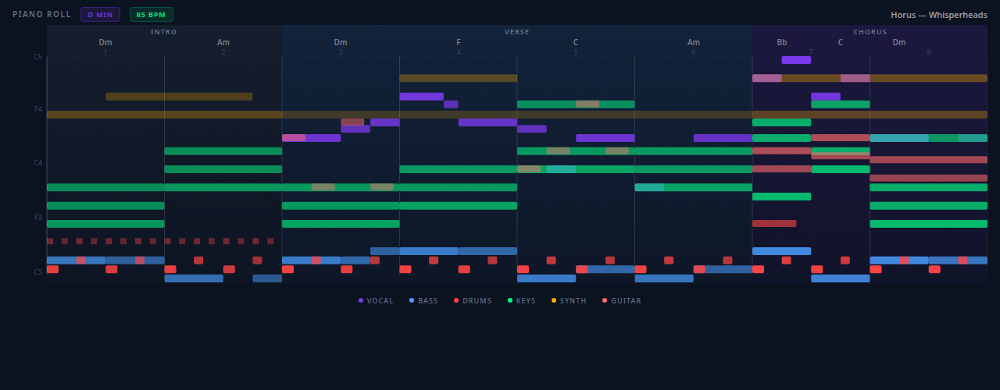
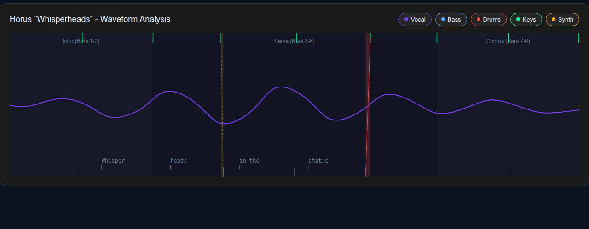
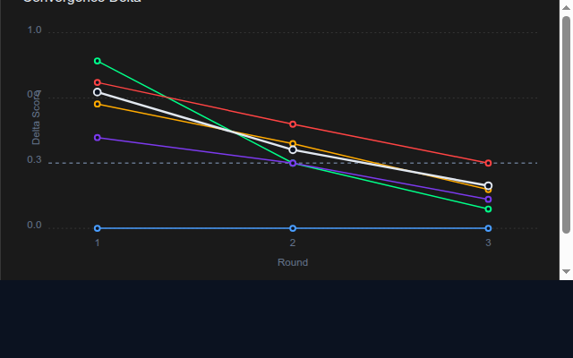
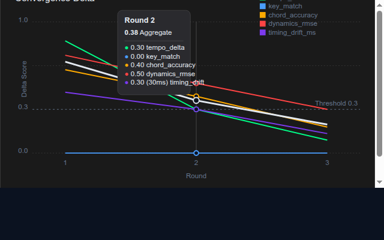
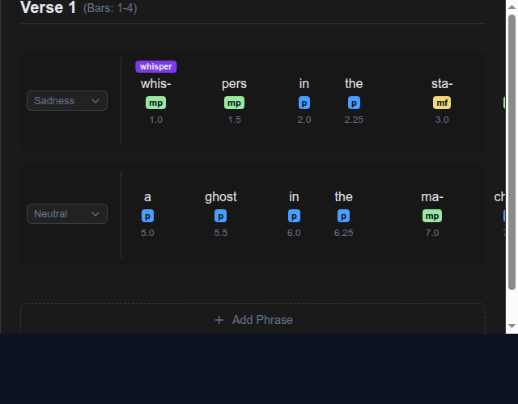
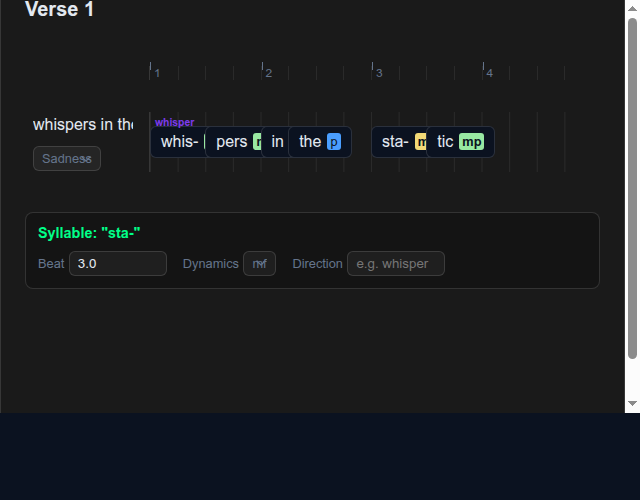
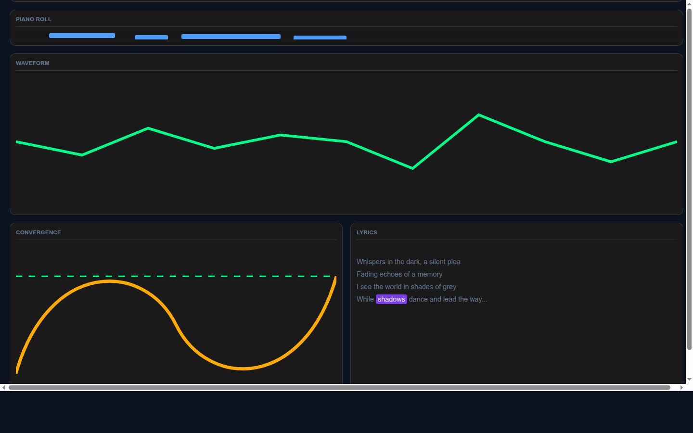
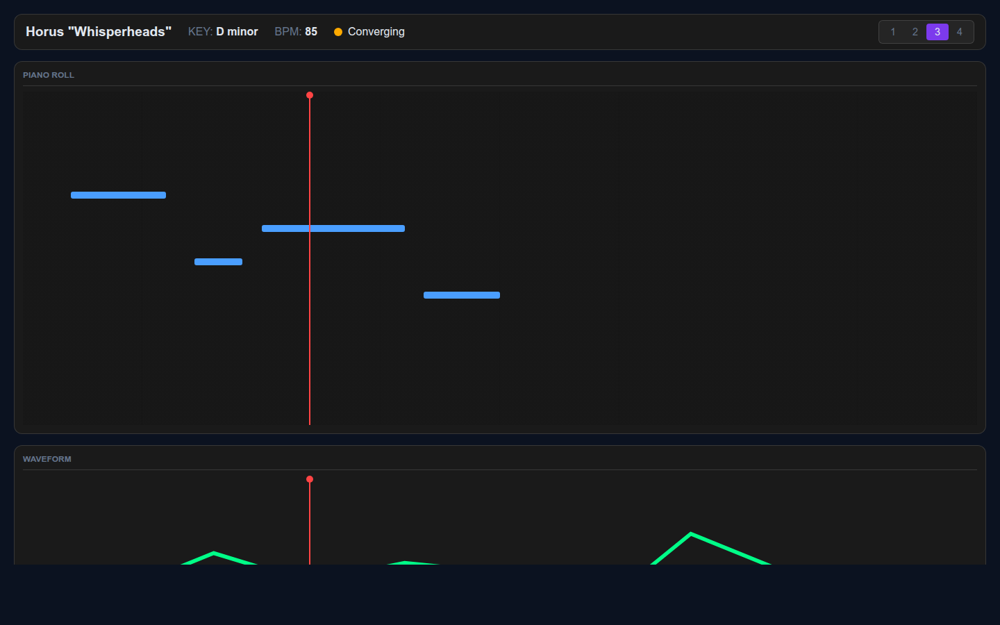

# Music Lab Design Board

> T3.1 Steve ↔ Nico Design Convergence | 2026-03-15
> Song: Horus "Whisperheads" | D minor, 85 BPM, 8 bars
> Backend: Gemini Flash via `/subagent-service` (1M context)

## Convergence Summary

| Pane | Rounds | Final | HIGH | MED | LOW | Approved |
|------|--------|-------|------|-----|-----|----------|
| PianoRoll | R1→R2 | R2 | 0 | 1 | 3 | Yes |
| Waveform | R1→R2 | R2 | 0 | 1 | 1 | Yes |
| ConvergenceChart | R1→R2→R3 | R3 | 0 | 0 | 0 | Yes |
| LyricsEditor | R1→R2→R3 | R3 | 0 | 0 | 0 | Yes |
| Dashboard | R1→R2→R3 | R3 | 0 | 0 | 0 | Yes |

## 1. Piano Roll View

| R1 | R2 (Approved) |
|----|---------------|
|  |  |

- **Rationale**: [steve-rationale-r2.md](piano-roll/steve-rationale-r2.md)
- **Critique**: [nico-critique-r2.md](piano-roll/nico-critique-r2.md)
- **Approval**: [approval.json](piano-roll/approval.json)
- **R1→R2 fixes**: Dedicated drum lane (24px targets), amber playhead overlay, SVG fill patterns per instrument (WCAG 1.4.1), minimap for 64-bar scalability
- **Remaining**: 1 MED (minimap should be data-driven), 3 LOW (pitch range default, playhead filter perf, selection API)

## 2. Waveform View

| R1 | R2 (Approved) |
|----|---------------|
|  |  |

- **Rationale**: [steve-rationale-r2.md](waveform/steve-rationale-r2.md)
- **Critique**: [nico-critique-r2.md](waveform/nico-critique-r2.md)
- **Approval**: [approval.json](waveform/approval.json)

## 3. Convergence Chart

| R1 | R2 | R3 (Approved) |
|----|----|----|
|  |  |  |

- **Rationale**: [steve-rationale-r3.md](convergence/steve-rationale-r3.md)
- **Critique**: [nico-critique-r3.md](convergence/nico-critique-r3.md)
- **Approval**: [approval.json](convergence/approval.json)

## 4. Lyrics Editor

| R1 | R2 | R3 (Approved) |
|----|----|----|
|  |  |  |

- **Rationale**: [steve-rationale-r3.md](lyrics-editor/steve-rationale-r3.md)
- **Critique**: [nico-critique-r3.md](lyrics-editor/nico-critique-r3.md)
- **Approval**: [approval.json](lyrics-editor/approval.json)

## 5. Dashboard Layout

| R1 | R2 | R3 (Approved) |
|----|----|----|
|  |  |  |

- **Rationale**: [steve-rationale-r3.md](dashboard/steve-rationale-r3.md)
- **Critique**: [nico-critique-r3.md](dashboard/nico-critique-r3.md)
- **Approval**: [approval.json](dashboard/approval.json)
- **Layout**: Piano roll (top, full width, 40%), Waveform (middle, full width, 25%), Convergence (bottom-left, 50%), Lyrics (bottom-right, 50%)
- **Shared timeline**: Piano roll + waveform + lyrics share horizontal time axis with synchronized playhead

## Design Tokens (EMBRY)

- Background: `#0b1220` (deep), `#1a1a1a` (card)
- NVIS: green `#00ff88`, red `#ff4444`, amber `#ffaa00`, blue `#4a9eff`, accent `#7c3aed`
- Text: `#e2e8f0` (white), `#64748b` (dim), `#334155` (muted)
- Border: `rgba(255,255,255,0.13)`, radius 12px
- Instruments: vocal=#7c3aed, bass=#4a9eff, drums=#ff4444, keys=#00ff88, synth=#ffaa00, guitar=#ff6b6b

## Convergence Process

Each pane ran a self-contained Steve↔Nico dialog inside `/subagent-service` (Docker container, Gemini Flash backend). The loop:

1. **Steve designs** → standalone HTML/CSS/SVG mockup + first-person rationale
2. **Nico reviews** → structured critique (HIGH/MEDIUM/LOW findings)
3. **Converge check** → 0 HIGH and ≤1 MEDIUM = approved
4. **If not converged** → Steve revises addressing all findings, loop back to step 2

All dialog transcripts preserved as `design-dialog.json` in each pane directory.

## Next: T3.2-T3.6 React Components

Each React component must be built FROM its approved mockup HTML — not from scratch. The mockup is the spec.
