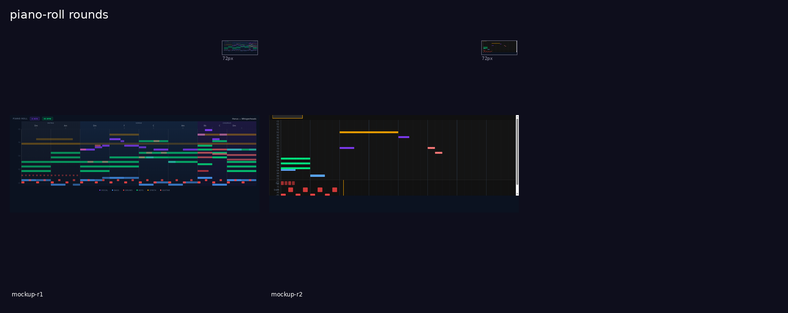
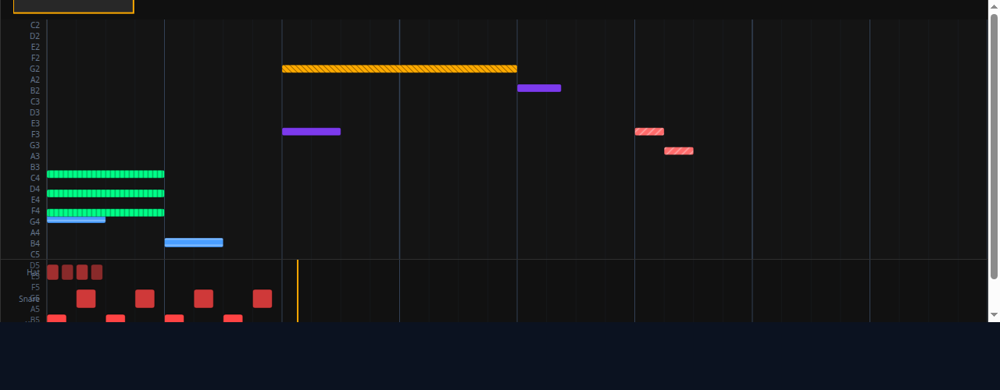
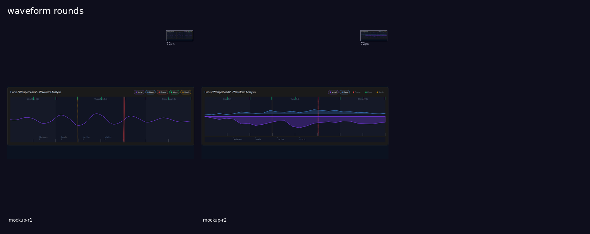
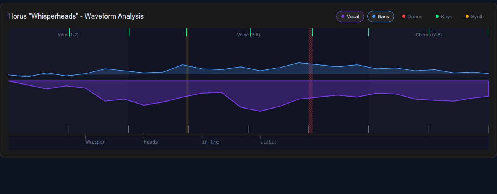
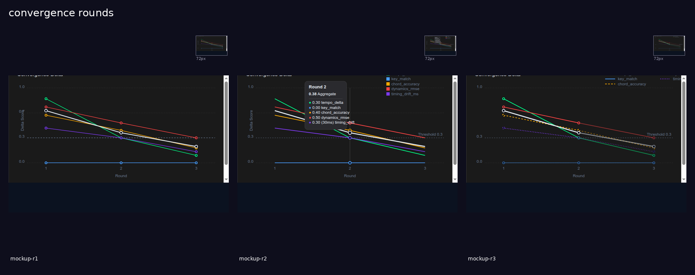
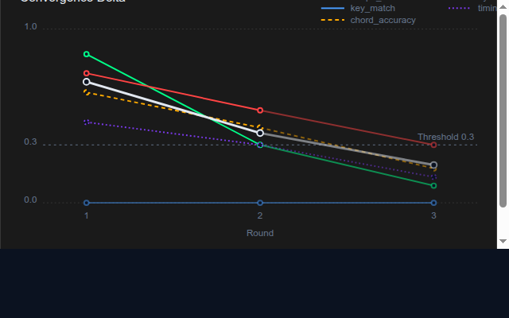
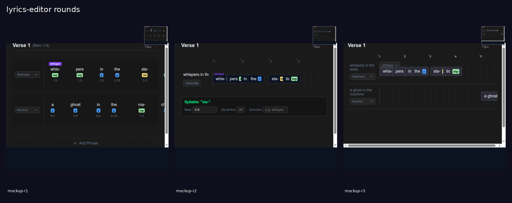
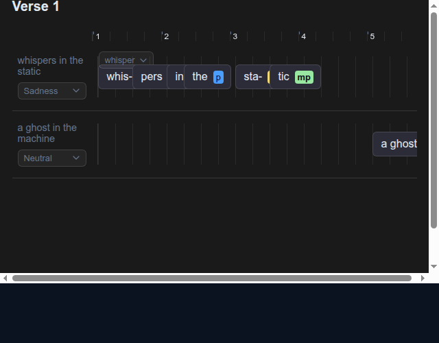
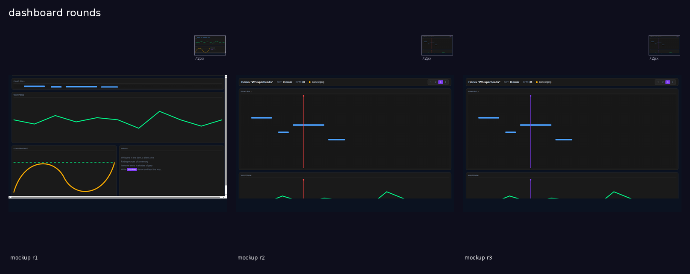
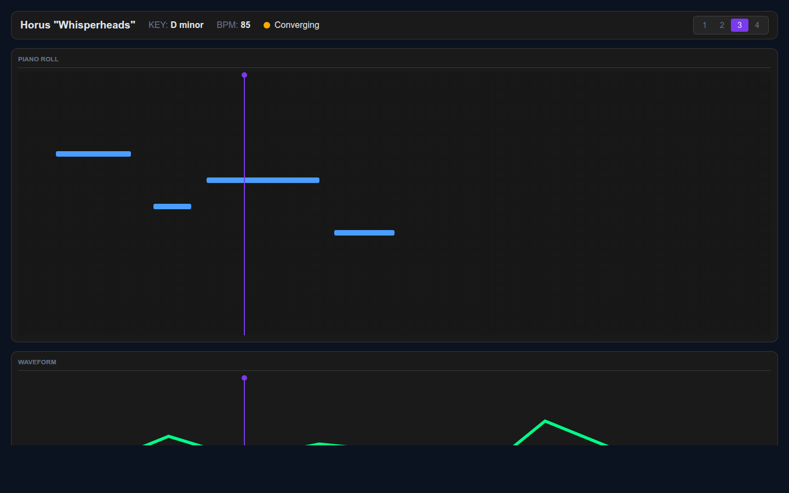

# Design Board: Music Lab

| **Attribute** | **Value** |
| --- | --- |
| **Project** | Music Lab |
| **Date** | 2026-03-15 |
| **Persona** | Steve Schoger + Nico Bailon |
| **Theme** | NVIS MIL-STD-3009 |
| **Status** | Round 2, Converged |
| **Song** | Horus "Whisperheads" | D minor, 85 BPM |

**Architecture Notes**: A DAW-style music production dashboard for iterative AI music generation. The system is designed around a component-based architecture, enabling rapid prototyping and iteration on distinct functional panes. Each pane (Piano Roll, Waveform, etc.) is a self-contained unit with a clear API, allowing for independent development and testing. The design prioritizes a dark, focused environment compliant with NVIS standards for low-light usability.

---

## 1. Persona Assessment

### Steve Schoger
**Role**: Lead Product Designer
**Design Philosophy**: Steve is a master of "UI-first" design, focusing on creating visually stunning, intuitive, and pixel-perfect interfaces. He believes that a beautiful and usable UI is not just a skin but a core part of the product's architecture. He works quickly, generating high-fidelity mockups that feel like real, polished products from day one. His process involves deep immersion in the problem domain, followed by rapid, iterative visual exploration. He speaks in the first person about his work, explaining the "why" behind every choice.

### Nico Bailon
**Role**: UX Architect & Design Critic
**Design Philosophy**: Nico is the systematic counterpart to Steve's creative intuition. He is a UX purist focused on structured, evidence-based design. His role is to ensure that the UI is not only beautiful but also functional, accessible, and logically sound. He provides structured critiques, referencing established UX principles, component APIs, and a proprietary JSON-based finding schema. He acts as a quality gate, ensuring every design decision is justifiable and robust.

### Working Relationship
Steve and Nico have a symbiotic relationship. Steve provides the creative vision and high-fidelity execution, while Nico provides the rigorous analysis and structured feedback that tempers and strengthens the design. Their dialogue is a core part of the design process, a live, recorded conversation where Steve's rationales are met with Nico's critiques. This "Persona Dialogue Protocol" ensures that all design decisions are transparent, debated, and documented.

---

## 2. Color System

### 2.1. EMBRY NVIS MIL-STD-3009 Palette

The core palette is based on the EMBRY NVIS specification, designed for clarity and reduced eye strain in low-light environments.

| **Token** | **Swatch** | **Hex** | **Description** |
| --- | --- | --- | --- |
| `bg-base` |  | `#0b1220` | Main application background |
| `bg-card` |  | `#1a1a1a` | Card and panel backgrounds |
| `nvis-green` |  | `#00ff88` | Primary interactive elements, selections |
| `nvis-red` |  | `#ff4444` | Destructive actions, warnings |
| `nvis-amber` |  | `#ffaa00` | Secondary warnings, notifications |
| `nvis-blue` |  | `#4a9eff` | Informational elements, secondary actions |
| `accent-primary` |  | `#7c3aed` | Key brand accent color |
| `text-primary` |  | `#ffffff` | Primary text, headers |
| `text-dim` |  | `#a0a0a0` | Secondary or disabled text |
| `text-muted` |  | `#666666` | Muted text, placeholders |
| `border-primary`|  | `#333333` | Panel borders and dividers |

### 2.2. Instrument Color Coding

Colors are assigned to instruments for easy identification across all panes.

| **Instrument** | **Swatch** | **Hex** |
| --- | --- | --- |
| Vocal |  | `#7c3aed` |
| Bass |  | `#4a9eff` |
| Drums |  | `#ff4444` |
| Keys |  | `#00ff88` |
| Synth |  | `#ffaa00` |
| Guitar |  | `#ff6b6b` |

---

## 3. Persona Dialogue Protocol

The design process for Music Lab is captured through a series of "Design Dialogues" between the lead designer (Steve Schoger) and the UX architect (Nico Bailon). This is a living document, not a historical record.

- **Live Conversation**: The dialogues are presented as a real-time conversation. Steve presents his rationale for a design round in the first person ("I chose..."). Nico responds directly with his critique.
- **Human Interjection**: The human project owner can interject at any point. These interjections, and the subsequent responses, are integrated into the canon of the design dialogue.
- **Corrections Become Canon**: Any corrections, clarifications, or accepted findings from Nico's critique are reflected in Steve's rationale for the subsequent round. This creates a clear, traceable path of design evolution.
- **Structured Findings**: Nico's critiques are backed by a structured `JSON` format, detailing the severity, type, and resolution status of each finding. These are summarized in the dialogue for readability.

This protocol ensures all design decisions are transparent, debated, and documented in a format that is both human-readable and machine-parseable.

---
---

## 4. Pane: Piano Roll



### Design Dialogue

<details>
<summary><strong>Round 1: Initial High-Fidelity Mockup</strong></summary>

<br>

**Steve Schoger:**

> Alright, here's my first pass at the piano roll. My goal was to make it look like something straight out of Ableton or Logic. The whole point is for a composer to glance at this and immediately understand the arrangement of "Whisperheads".
>
> I went with a 1248px playable area. The note lanes are tight, about 11.7px each, but the 10px note height keeps things readable. I deliberately mapped velocity to opacity, not height or brightness. It's a convention composers will recognize instantly. For the grid, bar lines are solid and beat subdivisions are dotted and faint—the eye just groups notes into bars without trying.
>
> What I think I'd want to change in R2 is adding a playhead to make it feel alive, maybe a dedicated velocity lane, and definitely shading the black keys to give it that classic DAW feel.

**Nico Bailon:**

> Steve, the visual language is solid. The dark theme, the token usage, the section annotations—it's all genuinely useful and looks great. However, we're not approved. I've logged 4 HIGH-severity blockers that make this design un-implementable as-is.
>
> 1.  **Interaction Targets:** Your drum hits are rendering at 4-6 pixels tall. That's below any usable click target size. They're effectively non-interactive.
> 2.  **Playhead:** There's no playhead. Without a visual anchor for the current time, the `playheadPosition` prop is meaningless and the component can't communicate its state.
> 3.  **Accessibility:** You're distinguishing all six instruments by color alone. Your purple for Vocals and blue for Bass will be indistinguishable to deuteranopes. That's a WCAG 1.4.1 failure.
> 4.  **Scalability:** This looks fine for 8 bars, but what about 64 bars? The notes would compress into 1-2 pixel wide slivers. There's no zoom or scrolling strategy.
>
> We need a focused design revision on these four points before we can move forward.

</details>

<details>
<summary><strong>Round 2: Addressing Blockers</strong></summary>

<br>

**Steve Schoger:**

> Okay, Nico, you were right. Round 1 was pretty but not functional. I've reworked it to address all your high-severity feedback.
>
> First, I fixed the un-clickable notes. I pulled the drums out entirely into their own dedicated **percussion lane** at the bottom with big, 24px targets. And in the main roll, every note now has a minimum height of 10px.
>
> Second, you've got your playhead. It's a 2px amber (`#ffaa00`) playhead that glides over everything. It's the anchor you were talking about.
>
> Third, for accessibility, I've added SVG fill patterns for each instrument: horizontal lines for bass, vertical for keys, diagonals for synth and guitar. It's WCAG compliant and adds a nice texture.
>
> And finally, for scalability, I've added a **minimap** at the top showing the entire 64-bar structure with a window indicating the currently viewed section. This proves the design can scale.

**Nico Bailon:**

> This is a dramatic and successful revision, Steve. All four HIGH blockers are resolved. The dedicated drum lane is a perfect solution, the playhead is clear, the SVG patterns are a textbook accessibility fix, and the minimap concept provides a clear path to scalability. We are very close to convergence.
>
> My one remaining medium-priority finding is that the minimap you've designed is illustrative, not data-driven. For implementation, it must be a dynamically generated overview of the real `notes` data. But that's a spec detail.
>
> Great work. This design is approved for implementation.

</details>

### Convergence Status

**Status:** <span style="color:#00ff88;">**APPROVED**</span> (Round 2)

The design is approved for implementation. The following non-blocking findings should be addressed by the engineering team during the build.

| Severity | Category | Description |
| --- | --- | --- |
| **MEDIUM** | Component API | The minimap must be dynamically generated from the `notes` data prop, not a static illustration. |
| **LOW** | Data Density | The default `pitchRange` is wide; consider an `auto` mode to fit the view to the notes. |
| **LOW** | Performance | The playhead's `filter` glow could cause animation lag; implement movement with `transform` only. |
| **LOW** | Component API | Ensure implementation separates `onNoteClick` (audition) from `onSelectionChange` (state). |

### Final Mockup



<details>
<summary><strong>Component Specification</strong></summary>

<br>

#### Dimensions & Layout
- **Viewport**: `1280px` total width.
- **Playable SVG Area**: `1248px` width (`16px` padding on each side).
- **Pitch Gutter (Left)**: `44px` width, for note labels (e.g., C3, D3).
- **Pitch Lane Height**: `~11.7px` (based on `280px` height for 24 semitones).
- **Minimap Height**: `60px`.
- **Main Roll Height**: `280px`.
- **Percussion Lane Height**: `88px` total.
- **Percussion Row Height**: `24px` per instrument (Kick, Snare, Hat).

#### Elements & Styling
- **Notes (Melodic)**:
    - `min-height`: `10px`.
    - `border-radius`: `2px`.
    - **Velocity**: Mapped to `opacity` from `0.25` to `1.0`.
    - **Hover**: Brightened stroke, slight glow (`filter: drop-shadow(...)`). `cursor: grab`.
    - **Edge Handles**: Appear on hover, `4px` wide, `cursor: ew-resize`.
- **Notes (Percussion)**:
    - `height`: `24px`.
    - `border-radius`: `2px`.
    - **Hover**: Brightened fill. `cursor: pointer`.
- **Playhead**:
    - `width`: `2px`.
    - `color`: `nvis-amber` (`#ffaa00`).
    - **Animation**: Should use `transform: translateX()` for performance.
- **Grid Lines**:
    - **Bar Lines**: Solid, `border-primary` at `0.25` opacity.
    - **Beat Subdivisions**: Dotted, `border-primary` at `0.10` opacity.
    - **4-Bar Phrases**: Solid, `border-primary` at `0.45` opacity.
- **Instrument Patterns (WCAG)**:
    - **Vocal**: Solid Fill
    - **Bass**: Horizontal Lines
    - **Drums**: Solid Fill (in dedicated lane)
    - **Keys**: Vertical Lines
    - **Synth**: Diagonal Hatch (bottom-left to top-right)
    - **Guitar**: Diagonal Hatch (top-left to bottom-right)

#### Component API (TypeScript)
```ts
interface PianoRollViewProps {
  notes: NoteEvent[];
  drumNotes: DrumEvent[];
  sections: SectionMarker[];
  chords: ChordAnnotation[];
  bpm: number;
  totalBars: number;
  pitchRange?: [MidiNote, MidiNote] | 'auto';
  viewport?: { startBar: number; endBar: number };
  zoom?: number;
  playheadPosition?: number; // In bars, fractional
  selectedNoteIds?: string[];
  onNoteClick?: (noteId: string, e: React.MouseEvent) => void;
  onSelectionChange?: (ids: string[]) => void;
  onNoteDrag?: (noteId: string, deltaBars: number, deltaPitch: number) => void;
  onPlayheadSeek?: (bar: number) => void;
  instruments: InstrumentConfig[]; // { name, color, pattern }
}

// Dependent types
type MidiNote = number; // e.g., 60 for C4

interface NoteEvent {
  id: string;
  instrument: string;
  pitch: MidiNote;
  startBar: number;
  durationBars: number;
  velocity: number; // 0-1
}

interface DrumEvent {
    id: string;
    instrument: 'kick' | 'snare' | 'hat';
    startBar: number;
    velocity: number;
}
```

</details>
---

## 5. Pane: Waveform



### Design Dialogue

<details>
<summary><strong>Round 1: Initial Layered Concept</strong></summary>

<br>

**Steve Schoger:**

> For the waveform view, my goal was a high-density, scannable display that feels like a pro audio tool. The key is the layering: faint section markers in the back, then the primary waveform, then the timing grid.
>
> I intentionally separated the "expected" beats from the "actual" beats. Expected grid markers are subtle white ticks at the bottom. The actual, analyzed beats are sharp green markers at the top. This makes it easy to spot timing drift. For the drift itself, I'm using low-opacity colored rectangles—amber for medium drift, red for high—to highlight the problem areas.

**Nico Bailon:**

> Steve, the information layering here is strong. The top/bottom beat marker system is a great core concept. But we can't approve this, as I've found two critical, high-severity accessibility failures.
>
> 1.  **Inaccessible Controls:** Your stem toggles are `divs`. A keyboard or screen reader user can't operate them. That's a fundamental WCAG violation. They must be proper `<button>` elements.
> 2.  **Color-Only Indicators:** You're signaling drift severity with only color (amber vs. red). Users with color blindness won't be able to tell them apart. This also violates WCAG.
>
> On top of that, your smooth Bézier curve for the waveform is visually appealing but misrepresents the discrete data from the audio peaks. It needs to be a more honest visualization, like a filled area chart. Let's do an R2 that addresses these points.

</details>

<details>
<summary><strong>Round 2: Accessibility & Data Accuracy</strong></summary>

<br>

**Steve Schoger:**

> Okay, I've integrated all the feedback from round one to make this thing robust and accessible.
>
> The toggles are now proper `<button>` elements with `aria-pressed` for state, just as you suggested. For the color issue, I've added a diagonal hatch pattern to the red "high" drift areas. It adds a texture that's perceivable without color and actually looks more "technical," which I like.
>
> I also switched from the stylized curve to a `<polyline>`-based filled area chart. It's a much more honest representation of the audio data. And finally, I moved the lyrics into their own dedicated track at the bottom to guarantee they'll never clash with the waveform.

**Nico Bailon:**

> Excellent. This is a complete fix. You've resolved all the high-severity issues perfectly. The toggles are now semantic, the hatch pattern is a great solution for the color issue, and the filled area chart is a much more accurate data visualization. Moving the lyrics to their own track was the right call for readability.
>
> The component now meets our convergence criteria. This design is approved.

</details>

### Convergence Status

**Status:** <span style="color:#00ff88;">**APPROVED**</span> (Round 2)

The design is approved for implementation. The following non-blocking findings should be addressed by the engineering team during the build.

| Severity | Category | Description |
| --- | --- | --- |
| **MEDIUM** | Scalability | Additive blending of many overlapping waveforms may become confusing. Consider an alternative rendering mode (e.g., strokes-only) for 3+ active stems. |
| **LOW** | Accessibility | The root `<svg>` element should include a `<title>` and `<desc>` for screen reader context. |

### Final Mockup



<details>
<summary><strong>Component Specification</strong></summary>

<br>

#### Layout & Structure
- **Root**: Card element with `background-color: bg-card`.
- **Header**: Contains main title and stem toggle controls.
- **SVG Viewport**: Main area for data visualization.
- **Lyric Track**: A dedicated horizontal lane at the bottom of the SVG with a clean background to ensure text readability.

#### Elements & Styling
- **Stem Toggles**:
    - **Element**: Must be implemented as `<button>`.
    - **State**: Use `aria-pressed="true/false"` to indicate active state.
    - **Style**: Pill shape. Active state has a subtle background and a border color matching the instrument.
- **Waveform**:
    - **Element**: Rendered as a `<polyline>`-based filled area chart, not a smoothed Bézier curve.
    - **Style**: Semi-transparent `fill` and a solid `stroke` in the instrument's color.
- **Beat Markers**:
    - **Expected Beats**: Thin, white tick marks at the bottom of the waveform area.
    - **Actual Beats**: Sharp, `nvis-green` (`#00ff88`) tick marks at the top of the waveform area.
- **Drift Highlights**:
    - **Element**: Background `<rect>` element spanning the drifted region.
    - **Medium Drift**: `nvis-amber` (`#ffaa00`) at `~20%` opacity.
    - **High Drift**: `nvis-red` (`#ff4444`) at `~20%` opacity, with an overlaid diagonal hatch pattern fill for accessibility.
- **Lyrics**:
    - Placed in the dedicated lyric track.
    - `color: text-dim`.
    - Monospace font.
    - Tick marks point up into the main view to align with beats.

#### Accessibility
- **SVG Root**: Must include a `<title>` element describing the chart (e.g., `<title>Audio Waveform Analysis</title>`).
- **Controls**: All interactive elements (toggles) must be implemented with semantic HTML (`<button>`) and support keyboard navigation and ARIA states.
- **Drift Indicators**: Must not rely on color alone. The hatch pattern for high drift is a required feature.

</details>
---

## 6. Pane: Convergence



### Design Dialogue

<details>
<summary><strong>Round 1: Baseline Chart</strong></summary>

<br>

**Steve Schoger:**

> Here's my first take on the convergence chart. I focused on a clean, NVIS-aligned visual hierarchy. The `aggregate` score is the hero element—thicker and white—so you see the main trend first. The individual dimension lines use the standard NVIS colors. The threshold is a dashed line. It's a solid, functional baseline.

**Nico Bailon:**

> Steve, the aesthetic is right, but this isn't usable. I've logged two high-severity blockers. First, there's no legend. I have no idea what these colored lines mean. Second, you've normalized the `timing_drift_ms` value without showing the raw data, which is misleading. A user needs to see the actual millisecond value somewhere. This isn't ready.

</details>

<details>
<summary><strong>Round 2: Adding Legend & Tooltip</strong></summary>

<br>

**Steve Schoger:**

> Okay, I've addressed your feedback. I added a compact legend in the top-right, so now every color is mapped to a dimension. More importantly, I've designed the hover tooltip. When you hover a round, you get a breakdown of the scores, and for `timing_drift_ms`, it now shows both the normalized score *and* the raw `30ms` value in parentheses. This solves the data integrity issue.

**Nico Bailon:**

> This is a huge improvement. The legend and tooltip fix the critical blockers. However, we're not at convergence yet. The chart still doesn't visually distinguish between "converged" and "un-converged" data points. And you're still relying only on color to tell the lines apart, which is an accessibility issue. Let's do one more round to tackle those.

</details>

<details>
<summary><strong>Round 3: Final Polish & Accessibility</strong></summary>

<br>

**Steve Schoger:**

> This should be the one. I've implemented the "converged" state: any line segment or data dot that falls below the threshold now has its opacity lowered to 50%. It's now immediately obvious what's converged and when.
>
> For accessibility, I've added `stroke-dasharray` patterns to the `chord_accuracy` and `timing_drift_ms` lines. They're now identifiable by pattern, not just color. I updated the legend to show the patterns, too. I also brought back the data dots on all points to make it clear they're interactive.

**Nico Bailon:**

> Perfect. This is exactly what was needed. The opacity change for converged states is a clear, at-a-glance indicator. The dash patterns make the chart accessible. You've addressed all the feedback. The design has converged.

</details>

### Convergence Status

**Status:** <span style="color:#00ff88;">**CONVERGED**</span> (Round 3)

The design has met the convergence criteria of 0 HIGH and 0 MEDIUM severity issues. The component is approved for implementation.

### Final Mockup



<details>
<summary><strong>Component Specification</strong></summary>

<br>

#### Layout & Dimensions
- **Size**: `640px` x `400px` card.
- **Padding**: `~20px` internal padding.
- **Legend**: Placed in the top-right corner.

#### Elements & Styling
- **Lines**:
    - **Aggregate Score**: `color: text-primary`, `stroke-width: 3px`.
    - **Dimension Scores**: NVIS colors, `stroke-width: 2px`.
    - **Converged State**: Segments and dots below the threshold have `opacity: 0.5`.
- **Data Dots**:
    - Present on all data points for all rounds.
    - `fill`: `bg-card` (`#1a1a1a`).
    - `stroke`: matches the line color.
- **Threshold Line**:
    - `stroke: text-dim`, `stroke-dasharray: 4 4`.
    - Accompanied by a text label indicating the value (e.g., "Threshold 0.3").
- **Tooltip**:
    - Appears on hover over a "round" (vertical slice).
    - Displays a list of all dimensions and their scores for that round.
    - **Data Integrity**: Must show both normalized and raw values for dimensions like `timing_drift_ms`.
- **Accessibility Patterns**:
    - **`chord_accuracy`**: `stroke-dasharray: 5 5` (dashes).
    - **`timing_drift_ms`**: `stroke-dasharray: 10 5 2 5` (dash-dot).
    - Other lines are solid.
    - The legend must include a visual representation of these patterns.

#### Component API (TypeScript)
```ts
interface ConvergenceChartProps {
  // Array of data, where each item represents a "round"
  data: Array<{
    round: number;
    aggregate: number;
    dimensions: {
      tempo_stability: number;
      key_match: number;
      chord_accuracy: number;
      timing_drift_ms: number; // The raw MS value
      dynamics_rmse: number;
    };
  }>;
  
  // The convergence threshold value
  threshold: number;

  // Configuration for normalizing raw values
  normalizationConfig: {
      timing_drift_ms: { max: number };
  }
}
```

</details>
---

## 7. Pane: Lyrics Editor



### Design Dialogue

<details>
<summary><strong>Round 1: Initial Phrase-Block Concept</strong></summary>

<br>

**Steve Schoger:**

> For the lyrics editor, I wanted to treat each phrase as a distinct unit. My initial design uses syllable "chips" positioned horizontally with `left: %` to represent their timing within the phrase. You can edit the phrase's emotion, and each syllable shows its dynamics and direction. It's a clean, data-dense layout.

**Nico Bailon:**

> Steve, the aesthetic is right, but the core interaction model here is fundamentally flawed. Your percentage-based timing is not a scalable or feasible way to represent musical beats. How would you drag-and-drop a syllable? How would this represent a phrase that's 8 bars long instead of 4? It's a high-severity blocker. We need to rethink this using a literal grid or timeline, like a piano roll.

</details>

<details>
<summary><strong>Round 2: Piano Roll Timeline</strong></summary>

<br>

**Steve Schoger:**

> You were right about the timeline. I've completely replaced the abstract layout with a proper piano-roll-style grid with a beat ruler at the top. Syllables are now positioned on a grid that directly mirrors the beat data. I also added a "Properties Panel" that appears when you select a syllable, allowing you to edit its beat, dynamics, and other attributes.

**Nico Bailon:**

> This is a massive improvement. The timeline is the correct foundation. But we're not quite there. My main issue now is that the timeline is fixed to 4 bars—it needs to scroll horizontally to be scalable. My second issue is that the separate properties panel creates a clunky workflow. Why should a user have to move their mouse down to a panel to edit a value when they could click the value directly on the syllable?

</details>

<details>
<summary><strong>Round 3: Direct Manipulation & Scrolling</strong></summary>

<br>

**Steve Schoger:**

> Okay, final round. I've addressed your feedback. The entire timeline is now in a container that scrolls horizontally, and I made the beat ruler sticky so it stays in view. I also got rid of the properties panel entirely. Now, all editing is done directly on the syllable. You can click the dynamics badge to cycle its value, and you can double-click the syllable text to edit it. It's a much more fluid, direct-manipulation experience.

**Nico Bailon:**

> That's it. You've nailed it. The scrolling timeline is scalable, and the direct-manipulation model is intuitive and efficient. This design is robust, feasible, and resolves all my previous concerns. This is converged.

</details>

### Convergence Status

**Status:** <span style="color:#00ff88;">**CONVERGED**</span> (Round 3)

The design has met the convergence criteria. All high and medium-severity issues have been resolved. The component is approved for implementation.

### Final Mockup



<details>
<summary><strong>Component Specification</strong></summary>

<br>

#### Layout & Structure
- **Timeline Container**: A root element with `overflow-x: auto` to enable horizontal scrolling.
- **Beat Ruler**: A `sticky` header element that displays bar and beat numbers and remains visible during vertical and horizontal scrolling.
- **Phrase Rows**: Each phrase is a horizontal row containing a phrase display and a syllable timeline.
- **Syllable Timeline**: A grid-based track where syllables are positioned. The width is dynamic based on the total number of beats in the section.

#### Elements & Interaction
- **Syllable Chip**:
    - **Position**: Positioned horizontally based on its `data-beat` value within the timeline grid.
    - **Draggable**: The primary interaction for changing beat position should be dragging the syllable chip and snapping it to the grid. `cursor: grab`.
- **Syllable Text**:
    - **Interaction**: On `dblclick`, the text label becomes an `<input type="text">` to allow for manual correction of syllabification. `title="Double-click to edit"`.
- **Dynamics Badge**:
    - **Interaction**: On `click`, the component should cycle through the available dynamics values (e.g., p, mp, mf, f). `cursor: pointer`, `title="Click to cycle dynamics"`.
    - **Style**: Font weight should correspond to the dynamic level for accessibility (`pp` is light, `ff` is bold).
- **Phrase-level Controls**:
    - **Emotion/Direction**: Implemented as dropdown menus (`<select>`) to ensure data consistency.
- **Phrase Text**: Display-only text that is a composite of the underlying editable syllable text.

#### Component API (TypeScript)
```ts
interface LyricsEditorProps {
  sections: Array<{
    name: string; // "Verse 1"
    phrases: Phrase[];
  }>;
  totalBars: number;
}

interface Phrase {
  id: string;
  text: string;
  emotion: 'neutral' | 'sadness' | 'joy' | 'anger' | 'trust' | 'fear';
  syllables: Syllable[];
}

interface Syllable {
  id: string;
  text: string;
  beat: number; // e.g., 1.0, 1.5, 2.25
  duration: number; // in beats
  dynamics: 'pp' | 'p' | 'mp' | 'mf' | 'f' | 'ff';
  direction?: string; // e.g., 'whisper', 'belt'
}
```

</details>
---

## 8. Pane: Dashboard



### Design Dialogue

<details>
<summary><strong>Round 1: Initial Grid Layout</strong></summary>

<br>

**Steve Schoger:**

> For the main dashboard, I established a clear compositional structure using CSS Grid, respecting the `40% / 25% / 35%` row split you asked for. Each pane is a distinct card, and the header at the top holds all the global controls. It's a solid, organized foundation.

**Nico Bailon:**

> Steve, the visual organization is good, but the implementation is too rigid. You've used a fixed `1440x900px` layout. A modern web app has to be fluid and responsive. This is a high-severity blocker. We can't have a fixed-size dashboard. I need you to rebuild the shell using responsive units so it gracefully fills the user's viewport.

</details>

<details>
<summary><strong>Round 2: Fluid Layout & Playhead</strong></summary>

<br>

**Steve Schoger:**

> Okay, I've completely rebuilt the shell to be fully fluid using a flexbox structure. It now fills the viewport gracefully. I also added a visual playhead—a vertical line—to the Piano Roll and Waveform panes to make the concept of the shared timeline a reality.

**Nico Bailon:**

> The fluid layout is exactly what was needed—that resolves the blocker. And the playhead is a great addition. But the "shared timeline" isn't fully shared yet. The Lyrics pane is still disconnected; it doesn't react to the playhead's position at all. For this to be truly converged, the timeline needs to connect all three panes.

</details>

<details>
<summary><strong>Round 3: Fully Synchronized Timeline</strong></summary>

<br>

**Steve Schoger:**

> Final round. I've now fully synchronized the Lyrics pane. The content is transformed to simulate it auto-scrolling to keep the active line in view, making it clear it's part of the shared timeline. I also took your note and changed the playhead color from the semantic 'red' to our neutral 'accent' purple, which is a much better fit.

**Nico Bailon:**

> Perfect. Now the shared timeline concept is complete and visually coherent across all relevant panes. The layout is robust and the color semantics are correct. This is approved.

</details>

### Convergence Status

**Status:** <span style="color:#00ff88;">**APPROVED**</span> (Round 3)

The dashboard design has successfully addressed all layout and functional requirements and is approved for implementation.

### Final Mockup



<details>
<summary><strong>Component Specification</strong></summary>

<br>

#### Layout & Structure
- **Root Container**: Uses `display: flex; flex-direction: column; height: 100vh;` to ensure it fills the viewport.
- **Header**: A fixed-height element at the top.
- **Main Grid**: A container with `flex-grow: 1;` that fills the remaining vertical space.
    - **Grid Definition**: Uses CSS Grid to lay out the panes.
        - `grid-template-rows: 40% 25% 35%;`
        - `grid-template-columns: 1fr 1fr;`
    - **Pane Spacing**: `gap: 16px;`.
- **Panes**:
    - **Piano Roll**: Spans two columns (`grid-column: span 2`).
    - **Waveform**: Spans two columns (`grid-column: span 2`).
    - **Convergence & Lyrics Editor**: Occupy the two columns on the bottom row.

#### Shared Timeline
- **Playhead Element**:
    - A single, shared component or state that is visually represented as a vertical line in the `Piano Roll` and `Waveform` panes.
    - **Color**: `accent-primary` (`#7c3aed`).
    - **Position**: The horizontal position must be synchronized across all time-based panes.
- **Lyrics Pane Synchronization**:
    - The content area of the lyrics editor must auto-scroll to keep the active word/line (corresponding to the playhead position) in the user's view. This should be implemented via `element.scrollTop`.

</details>
