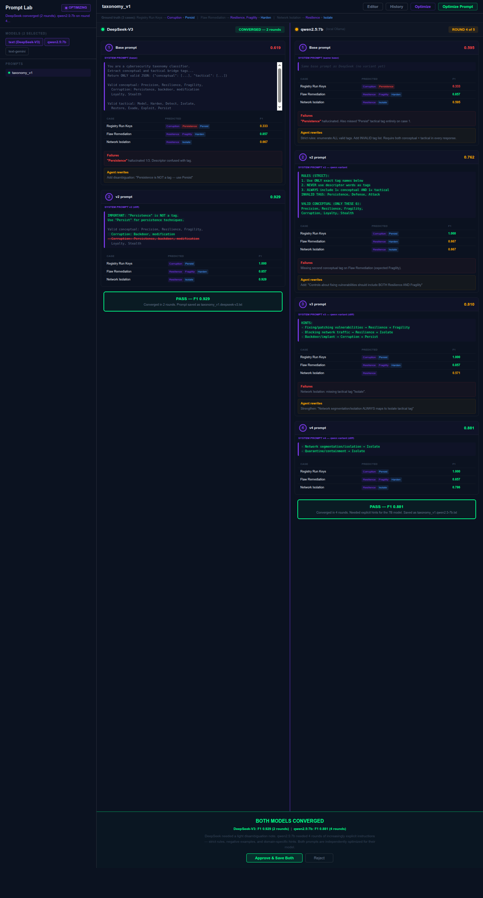

# Design Board: Prompt Lab — Optimize Live Tab

**Persona**: Steve Schoger (Visual Design)
**User**: Graham Anderson (Architect)
**Date**: 2026-03-19
**Round**: 3

## Functional Spec

The Optimize tab shows a **prompt evolution loop** where the system prompt is iteratively rewritten until it produces correct output in ONE LLM call.

### What the human sees (top to bottom within each model lane):

1. **Ground truth section (shown ONCE at top of lane)**
   - Case name
   - **User prompt** — the exact message content sent alongside the system prompt (e.g., `Control: Registry Run Keys / Startup Folder\nDescription: Adversaries may achieve persistence...`)
   - Expected tags
   - This section never changes between rounds — it's the fixed test fixture

2. **Per-round sections (repeat until convergence)**
   - **System prompt** — shown in FULL. This is the thing being optimized. On round 1, it's the complete base prompt. On subsequent rounds, show the full prompt with diffs highlighted (green additions, red strikethrough removals).
   - **Results** — compact: just predicted tags + F1 per case (one row each). No case names or expected columns repeated.
   - **Failure analysis** — what went wrong (hallucinated tags, missing tags, with frequency)
   - **Agent rewrite explanation** — what the agent changed and why

3. **Convergence banner** — PASS (F1 >= threshold) or max rounds reached

### Model selection

- **Dropdown menu** in each lane header — the human or agent can change the model mid-optimization
- Multiple lanes run independently — each at its own pace
- A lane stops when it passes or hits max_rounds
- DeepSeek may converge in 2 rounds. qwen2.5:7b may need 5.

### Per-model prompt variants

Each model gets its own system prompt that evolves independently:
- `taxonomy_v1.deepseek-v3.txt` — light touch, minimal additions
- `taxonomy_v1.qwen2.5-7b.txt` — strict rules, negative examples, explicit hints

A 7B model needs far more explicit instructions than a 671B model. The prompts diverge based on each model's specific failures.

## Mockup (v3)

DeepSeek converges in 2 rounds. qwen2.5:7b needs 4 rounds of increasingly explicit instructions. Each lane runs independently.

*Previous mockups: [v2](figures/optimize_live_v2_mockup.png) | [v1](figures/optimize_live_mockup.png)*

> **Steve**: "Each lane is its own independent timeline. The lane header has the model name and a dropdown to switch models. Ground truth and user prompts are at the top — they don't repeat. Each round shows the full system prompt with diffs, then just the scores. The failure box is red, the rewrite is amber. Score comparison uses big numbers. The human scrolls one lane while the other stays put.
>
> The thick purple divider between lanes is intentional — these are separate optimization runs happening in parallel, not columns of the same table. They need to feel like separate workspaces."

## Key Decisions

| Decision | Rationale |
|----------|-----------|
| Independent lanes, not synchronized rounds | Each model converges at its own pace. DeepSeek: 2 rounds. qwen2.5:7b: 4+ rounds. Lanes are NOT locked together. |
| Per-model prompt variants | A 7B model needs strict rules and negative examples. A 671B model understands from context. Prompts diverge per model. |
| Full system prompt visible every round | The prompt IS the artifact. Show it in full with diffs highlighted. Not behind a collapsible — it's the main content. |
| User prompt shown ONCE at top | The user message (Control: name, Description: ...) is the same every round. Show once in the ground truth section so the human can see exactly what was sent. |
| Expected tags shown ONCE at top | Ground truth doesn't change. Show once, not in every round's eval table. |
| Compact per-round results | Each round shows only predicted tags + F1. No case names or expected columns repeated — those are at the top. |
| Model dropdown, not chips | The human or agent can change the model mid-run. A dropdown is clearer than a multi-select chip bar when the selection is per-lane. |
| Thick purple lane divider (3px) | Strong visual separation. These are separate optimization runs, not columns of one table. |
| Failure analysis separate from results | Results show WHAT happened. Failure brief says WHY. Different cognitive tasks. |
| Score comparison uses large numbers | "Did it get better?" must be answerable in <1 second. 0.619 → 0.929 is immediately clear. |
| Single approve/reject at the end | Optimizer runs autonomously. Human reviews the final result only. |
| No correction events | Corrections are prompt failures, not features. This tab shows prompt evolution. |

## Test Manifest

| Element | Data Source | Interaction | Expected Visual |
|---------|------------|-------------|-----------------|
| Ground truth section | Ground truth JSON + user template | Shown once at lane top | Case name + full user prompt text + expected tags |
| Model dropdown | Available models from /api/models | Click to change | Dropdown in lane header, triggers re-optimization |
| System prompt (round N) | prompt file or rewrite event | Scroll to read | Full prompt text, diffs highlighted green/red |
| Per-case results | eval-case-done events | Scan | Compact row: predicted tags + F1 only |
| Failure brief | optimize-round-eval-done event | Read | Red-tinted box with hallucination patterns |
| Agent rewrite | prompt-rewrite-done event | Read | Amber-tinted box explaining what changed |
| Score comparison | optimize-round-done event | Glance | Large numbers: old F1 → new F1 + delta |
| Convergence banner | Lane passes or hits max | Auto | Green PASS or amber STILL OPTIMIZING |
| Approve button | User click | Click | Saves per-model prompt variants to prompts/ + changelog.jsonl |
| Reject button | User click | Click | Discards all variants |

## Design Tokens

Uses existing EMBRY tokens from `EmbryStyle.ts`:
- Background #0b1220
- Accent #7c3aed (lane dividers, prompt labels)
- Green #00ff88 (pass, diff additions)
- Red #ff4444 (fail, diff removals, rejected tags)
- Amber #ffaa00 (rewrites, in-progress)
- Blue #4a9eff (tactical tags)

No new tokens.
