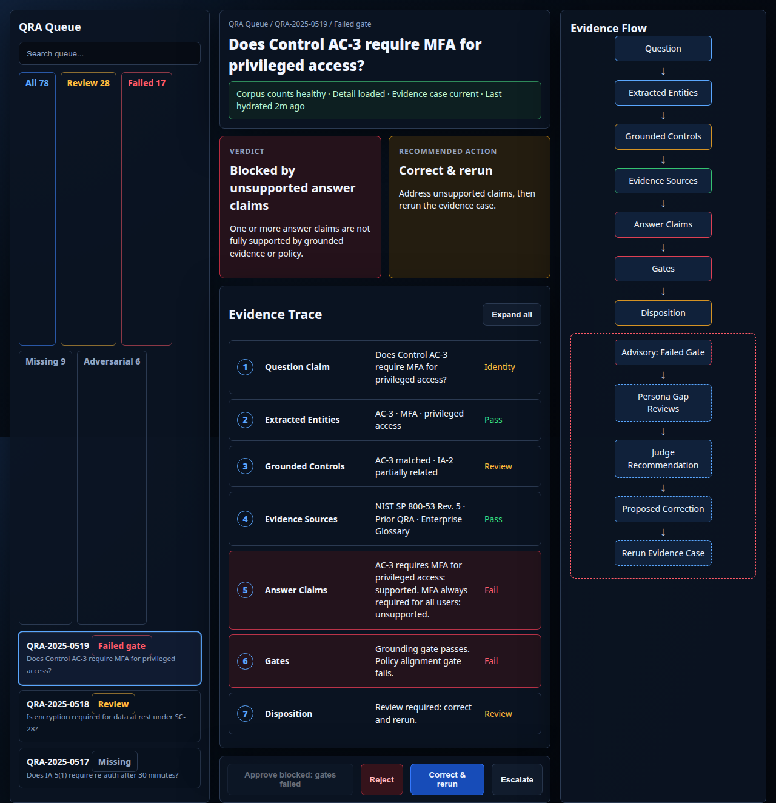

# SPARTA QRA Annotation Blockers Design Board

## Functional Spec

The QRA annotation page must support these operator states before implementation proceeds:

1. **Blocked deep-link recovery**: if a `qra` key is present but the QRA document is not loaded, the center pane shows an operational recovery trace and hides document review actions.
2. **Loaded QRA, pending evidence**: the QRA shell is visible, evidence is explicitly loading or blocked, and review actions explain why approval is unavailable.
3. **Loaded QRA, failed evidence**: unsupported claims, failed gates, adversarial/ambiguous state, and recommended repair are visible without enabling unsafe approval.
4. **Loaded QRA, evidence passed**: approval is available only when the evidence gate and human review preconditions allow it.
5. **Count failure or stale queue data**: corpus counts use `ERR`, `unknown`, or `stale` states rather than true zeroes when status-count data is unavailable or conflicts with loaded rows.
6. **Source-grounded vs advisory separation**: cited evidence and gates are visually distinct from persona/judge repair recommendations.
7. **Keyboard annotation**: queue, trace rows, evidence-flow nodes, and footer actions are reachable and show visible focus.

## Persona Rationale

> **Brandon Bailey**
>
> "I am using this page to decide whether a generated QRA is ready for human blessing, needs correction, or should be quarantined as adversarial training. I need the UI to behave like a trace debugger: show me where the evidence chain broke, show me whether the data pipeline itself failed, and never let advisory persona text look like source evidence."
>
> **Test implication**: every QRA state must show one safe primary action, an explicit blocked-approval reason when approval is unavailable, and a visible separation between source-grounded evidence and advisory repair flow.

## Mockup Evidence



The mockup defines the intended information order:

1. queue and evidence-status filters,
2. selected QRA identity and operational health,
3. verdict and recommended action,
4. textual evidence trace,
5. compact evidence-flow DAG,
6. pinned action bar.

## Design Decisions

The evidence-flow graph is a mini-map, not a primary graph workspace. It stays bounded to:

```text
Question -> Extracted Entities -> Grounded Controls -> Evidence Sources -> Answer Claims -> Gates -> Disposition
```

The advisory repair branch is dashed and labeled advisory:

```text
Failed Gate -> Persona Gap Reviews -> Judge Recommendation -> Proposed Correction -> Rerun Evidence Case
```

For blocked deep links, the normal evidence summary is replaced with a recovery trace because no trustworthy QRA document exists yet. Document-specific actions are hidden until the QRA body is loaded.
