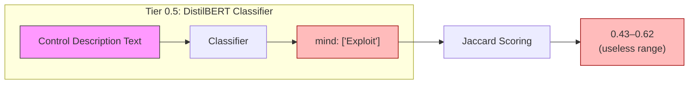
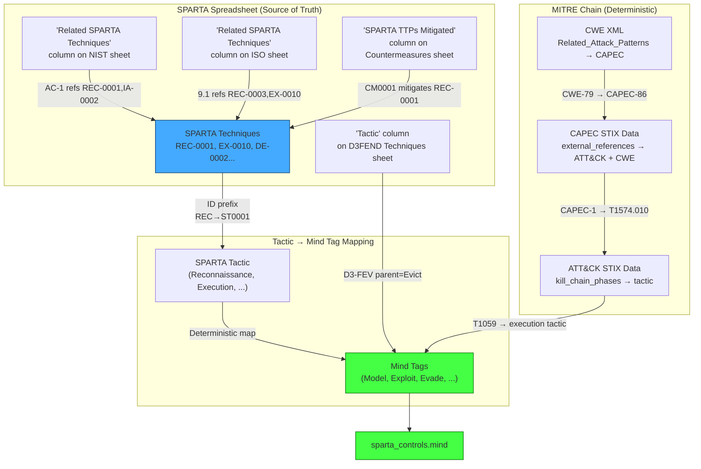
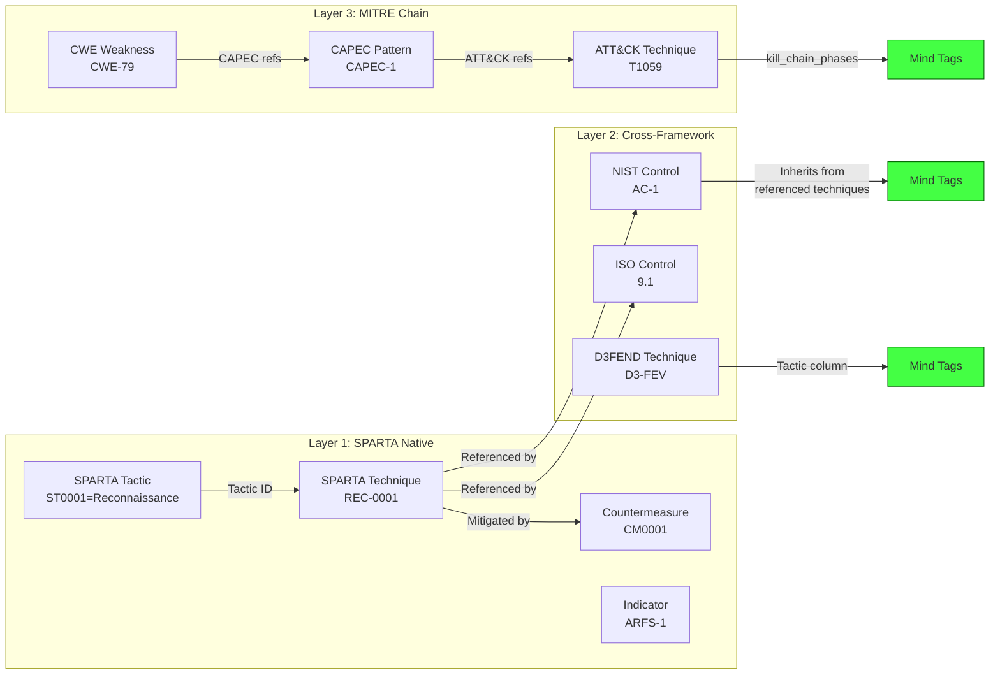
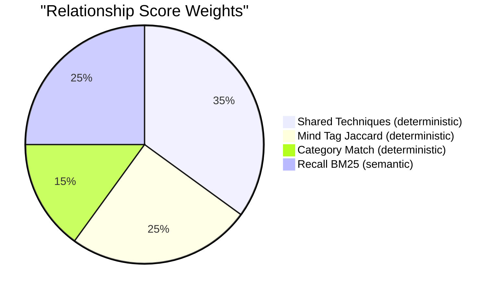
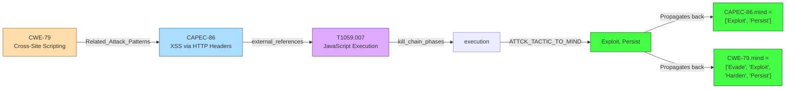
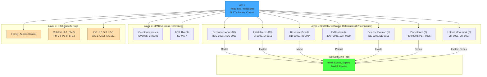

# SPARTA Taxonomy Mind Tag Fix — 2026-03-26

## Problem

Relationship scores in the SPARTA knowledge graph had a narrow, unusable spread (0.43–0.62 for non-curated relationships). Root cause: the `mind` tags used for Jaccard scoring were derived by a **text classifier** that collapsed nearly all controls to a single tag — 77% had only `['Exploit']`, 15% had `['Harden']`. With only ~15 distinct tag combinations across 11,620 controls, the Jaccard term was effectively binary (0.0 or 1.0) and contributed nothing to differentiation.

The SPARTA spreadsheet contains **explicit cross-reference columns** mapping every framework's controls back to SPARTA techniques, but these were never used for mind tag derivation.

## Architecture

### Before: Classifier-Only Mind Tags



**15 distinct tag combinations, ~0 Jaccard resolution**

### After: Deterministic Derivation from SPARTA Cross-References



**62 distinct tag combinations, meaningful Jaccard resolution**

## Data Flow: Mind Tag Derivation



## Relationship Scoring Formula

Each `technique_reference` relationship between two controls is scored with 4 signals:

```
combined_score = 0.35 * shared_technique_ratio
               + 0.25 * mind_tag_jaccard
               + 0.15 * category_match
               + 0.25 * recall_bm25
```

| Signal | Weight | Source | Type |
|--------|--------|--------|------|
| **Shared Technique Ratio** | 0.35 | Count of SPARTA techniques referencing both controls / union | Deterministic |
| **Mind Tag Jaccard** | 0.25 | Jaccard similarity of enriched mind tag sets | Deterministic |
| **Category Match** | 0.15 | Same parent/family (0.5) + same framework (0.5) | Deterministic |
| **Recall BM25** | 0.25 | `/memory recall` BM25 + graph traversal score | Semantic |



## MITRE Bridge: CWE → CAPEC → ATT&CK



**Pipeline step:** `01c_load_capec.py` builds all edges. Mind tag propagation runs after.

| Artifact | Count |
|----------|-------|
| CAPEC patterns ingested | 615 |
| CAPEC → ATT&CK edges | 272 |
| CAPEC → CWE edges | 1,214 |
| CWE → ATT&CK bridge edges | 567 |
| CWEs enriched via chain | 147 |
| ATT&CK techniques with tactic-derived tags | 835 |

## Results

### Mind Tag Resolution

| Metric | Before | After |
|--------|--------|-------|
| Distinct mind tag combos | 15 | **62** |
| Multi-tag controls | 8% | **22%** |
| Controls with no tags | 5% | **0.05%** |

### Per-Framework Coverage

| Framework | Controls | Multi-tag | Single-tag | None |
|-----------|----------|-----------|------------|------|
| NIST | 1,905 | 567 (30%) | 1,338 | 0 |
| CWE | 969 | 859 (89%) | 110 | 0 |
| ATT&CK Enterprise | 1,778 | 317 (18%) | 1,461 | 0 |
| CAPEC | 615 | 83 (13%) | 532 | 0 |
| SPARTA | 553 | 205 (37%) | 342 | 6 |
| D3FEND | 424 | 195 (46%) | 229 | 0 |
| ESA | 137 | 9 (7%) | 128 | 0 |

### Example: AC-1 (NIST Access Control) — Full Hierarchy

**Before:** `mind: ['Harden']` — a single flat tag from a text classifier.

**After:** Three layers of deterministic taxonomy, all from the SPARTA spreadsheet and MITRE data:

```
AC-1 (NIST / Access Control)
├── mind: ['Evade', 'Exploit', 'Model', 'Persist']     ← derived from techniques below
├── nist_family: "Access Control"                        ← NIST-specific category
├── sparta_technique_count: 67
├── sparta_technique_profile:                            ← LAYER 1: which SPARTA techniques?
│   ├── Reconnaissance (31): REC-0001..REC-0009         → mind: Model
│   ├── Initial Access (13): IA-0002..IA-0013           → mind: Exploit
│   ├── Resource Development (8): RD-0002..RD-0004      → mind: Model
│   ├── Exfiltration (6): EXF-0006..EXF-0009            → mind: Persist
│   ├── Defense Evasion (5): DE-0002..DE-0011            → mind: Evade
│   ├── Persistence (2): PER-0003, PER-0005              → mind: Persist
│   └── Lateral Movement (2): LM-0001, LM-0007          → mind: Persist, Exploit
├── related_sparta_countermeasures: [CM0088, CM0005]     ← LAYER 2: SPARTA cross-refs
├── related_nist_controls: [IA-1, PM-9, PM-24, ...]     ← LAYER 3: NIST-specific tags
├── related_iso_controls: [5.2, 5.3, 7.5.1, A.5.1, ...]
└── tor_threats: [SV-MA-7]
```



### Comparison: NIST Control ↔ SPARTA Countermeasure

```json
{
  "AC-1": {
    "framework": "NIST",
    "family": "Access Control",
    "mind": ["Evade", "Exploit", "Model", "Persist"],
    "technique_count": 67
  },
  "CM0001": {
    "framework": "SPARTA",
    "type": "countermeasure",
    "mind": ["Evade", "Exploit", "Harden", "Model", "Persist"],
    "technique_count": 44
  },
  "shared_techniques": 39,
  "shared_by_tactic": {
    "Reconnaissance": 30,
    "Exfiltration": 3,
    "Initial Access": 2,
    "Defense Evasion": 2,
    "Persistence": 1,
    "Lateral Movement": 1
  },
  "mind_jaccard": 0.80,
  "shared_technique_ratio": 0.54,
  "score": 0.39
}
```

AC-1 and CM0001 share **39 of 72 techniques** (54%). Mostly Reconnaissance — both address spacecraft design information protection. Mind overlap is 4/5 tags (80%). Strong relationship.

### Comparison: NIST Control ↔ CWE Weakness

```json
{
  "AC-1": {
    "framework": "NIST",
    "family": "Access Control",
    "mind": ["Evade", "Exploit", "Model", "Persist"],
    "technique_count": 67
  },
  "CWE-287": {
    "framework": "CWE",
    "type": "weakness",
    "pillar": "CWE-284",
    "abstraction": "Class",
    "mind": ["Evade", "Exploit", "Harden", "Model", "Persist"],
    "technique_count": 140,
    "capec_ids": ["CAPEC-114", "CAPEC-115", "CAPEC-151", "..."],
    "attack_technique_ids": ["T1134", "T1040", "T1548", "T1557", "..."]
  },
  "shared_techniques": 35,
  "shared_by_tactic": {
    "Reconnaissance": 14,
    "Resource Development": 8,
    "Initial Access": 5,
    "Defense Evasion": 3,
    "Persistence": 2,
    "Exfiltration": 2,
    "Lateral Movement": 1
  },
  "mind_jaccard": 0.80,
  "shared_technique_ratio": 0.20,
  "score": 0.27
}
```

CWE-287 (Improper Authentication) has its own MITRE chain: `CWE-287 → CAPEC-114,CAPEC-115... → T1134,T1548... → Exploit,Evade`. The CWE brings 140 technique references (broader than AC-1's 67), so the shared ratio is lower (20%) despite 35 shared techniques. The CWE's `pillar_cwe: CWE-284` and `abstraction: Class` are CWE-specific taxonomy tags.

## Files Changed

### SPARTA Pipeline
- **`src/sparta/pipeline/steps/04_extract_controls.py`** — Added `SPARTA_TACTIC_TO_MIND`, `D3FEND_TACTIC_TO_MIND` mappings and `derive_mind_tags_from_techniques()`. NIST, ISO, D3FEND, countermeasures, techniques, tactics, and indicators all derive mind tags from spreadsheet cross-references during extraction.

### Taxonomy Skill
- **`.pi/skills/taxonomy/taxonomy.py`** — Added Tier 0 `derive_mind_from_sparta_refs()` function. Regex extracts SPARTA technique IDs from text, maps to mind tags via prefix→tactic→mind chain. Runs before classifier (Tier 0.5), merges results. Added `import re`.

### Memory API
- **`memory/src/graph_memory/service/app/_core.py`** — Added `nrs_score`, `combined_score`, `control_id` to `_ALLOWED_SORT_FIELDS`.

### Data (ArangoDB)
- 1,092 controls backfilled with spreadsheet-derived mind tags
- 835 ATT&CK techniques tagged from STIX kill_chain_phases
- 615 CAPECs tagged (177 from ATT&CK refs, 438 default Exploit)
- 147 CWEs enriched through CAPEC→ATT&CK chain
- 1,486 CAPEC relationship edges created (272 ATT&CK + 1,214 CWE)
- 567 CWE→ATT&CK bridge edges created
- 49,208 technique_reference relationships rescored with 4-signal formula

## Tactic → Mind Tag Mapping Reference

### SPARTA Tactics
| Tactic ID | Name | Mind Tags |
|-----------|------|-----------|
| ST0001 | Reconnaissance | Model |
| ST0002 | Resource Development | Model |
| ST0003 | Initial Access | Exploit |
| ST0004 | Execution | Exploit, Persist |
| ST0005 | Persistence | Persist |
| ST0006 | Defense Evasion | Evade |
| ST0007 | Lateral Movement | Persist, Exploit |
| ST0008 | Exfiltration | Persist |
| ST0009 | Impact | Exploit, Persist |

### ATT&CK Tactics
| Tactic | Mind Tags |
|--------|-----------|
| reconnaissance | Model |
| resource-development | Model |
| initial-access | Exploit |
| execution | Exploit, Persist |
| persistence | Persist |
| privilege-escalation | Exploit |
| defense-evasion | Evade |
| credential-access | Exploit |
| discovery | Model |
| lateral-movement | Persist, Exploit |
| collection | Persist |
| command-and-control | Persist |
| exfiltration | Persist |
| impact | Exploit, Persist |

### D3FEND Tactics
| Tactic | Mind Tags |
|--------|-----------|
| Model | Model |
| Harden | Harden |
| Detect | Detect |
| Isolate | Isolate |
| Deceive | Evade |
| Evict | Restore |
